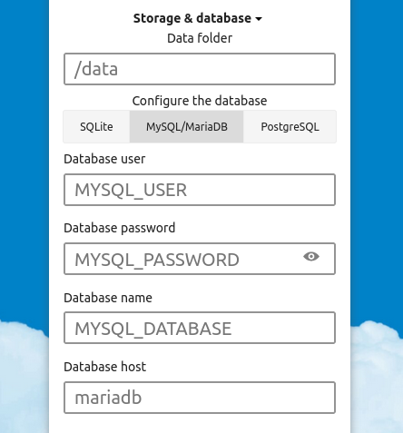
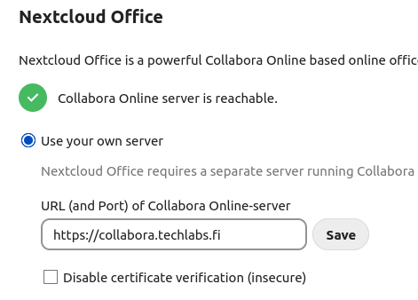

# Prerequisites

* A fully qualified domain name (FQDN)
* A Server with a public IP

The software needed to deploy the services is Docker Engine. As our server is running **Ubuntu server 22.04.1 LTS**, I used the instructions for the repository install method with the post-install steps to run docker as a non-root user.

* <<https://docs.docker.com/engine/install/ubuntu/#install-using-the-repository>\>
* <<https://docs.docker.com/engine/install/linux-postinstall/#manage-docker-as-a-non-root-user>\>

# DNS

Before we deploy Nextcloud we need to setup DNS records. There are two DNS records that are required for our setup to work. One for Nextcloud and another for Collabora. We however, have 3:

| TYPE  | HOSTNAME              | DESTINATION     |
|-------|-----------------------|-----------------|
| A     | csc.techlabs.fi       | 86\.50.228.85    |
| CNAME | nextcloud.techlabs.fi | csc.techlabs.fi |
| CNAME | collabora.techlabs.fi | csc.techlabs.fi |

The A record points to the IP of the server and the CNAME records point to the A record. The only purpose of the A record is to have an IP for the CNAME records. In case we need to migrate to a different server with a different IP, only the A record has to be changed.

Nextcloud is accessed through <https://nextcloud.techlabs.fi> and is the only address that will be visible to the user. The Collabora CNAME record is used to reach the Collabora service. You can observe the requests from your browser's developer console while using any of the tools provided by Collabora.

# Docker

At the heart of Techlabs Nextcloud is Docker. We use Docker to deploy 4 containers, each with a specific role.

1. linuxserver/swag
2. linuxserver/nextcloud
3. linuxserver/mariadb
4. collabora/code

The first container is called swag, provided by the [linuxserver.io](https://www.linuxserver.io/) open-source community.

> SWAG - Secure Web Application Gateway sets up an Nginx webserver and reverse proxy with php support and a built-in certbot client that automates free SSL server certificate generation and renewal processes (Let's Encrypt and ZeroSSL). It also contains fail2ban for intrusion prevention.

We use SWAG as described above. It works as our reverse proxy for Nextcloud and Collabora services and it automates Let's Encrypt SSL certificate generation for HTTPS. Additionally we use the included fail2ban for added security. If someone tries to login with invalid credentials too many times they get IP banned for a specific amount of time.

Next we have the Nextcloud container which contains the Nextcloud files and an Nginx webserver. It uses the Mariadb container as it's database. Nextcloud doesn't ship Office tools like Word or Excel by default. This is why we have the collabora/code container, it provides the tools for creating advanced word documents, spreadsheets, presentations and diagrams.

## Docker Compose

We use [Docker Compose](https://docs.docker.com/compose/) to deploy the containers. To deploy we need a `docker-compose.yml` file. In this file we can configure each service. It is worth noting that additional configuration is required for some of the containers we are using. In it's entirety, our `docker-compose.yml` reads as follows:

```
version: "2.1"
services:

  swag:
    image: lscr.io/linuxserver/swag:latest
    container_name: swag
    networks:
      - tlab-net
    cap_add:
      - NET_ADMIN
    environment:
      - PUID=1000
      - GUID=1000
      - TZ=Europe/Helsinki
      - URL=techlabs.fi
      - VALIDATION=http
      - SUBDOMAINS=nextcloud,collabora
      - ONLY_SUBDOMAINS=true
    volumes:
      - /home/ubuntu/techlabs-nextcloud/swag/config:/config
    ports:
      - 443:443
      - 80:80
    restart: always

  nextcloud:
    image: lscr.io/linuxserver/nextcloud:latest
    container_name: nextcloud
    networks:
      - tlab-net
    environment:
      - PUID=1000
      - GUID=1000
      - TZ=Europe/Helsinki
    volumes:
      - /home/ubuntu/techlabs-nextcloud/nextcloud/config:/config
      - /home/ubuntu/techlabs-nextcloud/nextcloud/data:/data
    restart: always
  
  mariadb:
    image: lscr.io/linuxserver/mariadb:latest
    container_name: mariadb
    networks:
      - tlab-net
    env_file:
      - ./mariadb.env
    volumes:
      - /home/ubuntu/techlabs-nextcloud/mariadb/config:/config
    restart: always

  collabora:
    image: collabora/code
    container_name: collabora
    networks:
      - tlab-net
    privileged: true
    environment:
      - dictionaries=en_GB en_US sv_FI sv_SE fi_FI
    restart: always
  
networks:
  tlab-net:
```

The environment variables for the *mariadb* container is read from a separate file, it contains the database credentials. The file contains the following:

```
PUID=1000
PGID=1000
TZ=Europe/Helsinki
MYSQL_ROOT_PASSWORD=REDACTED
MYSQL_DATABASE=REDACTED
MYSQL_USER=REDACTED
MYSQL_PASSWORD=REDACTED 
```

The *docker-compose.yml*, along with *mariadb.env* is located under:

```
/home/ubuntu/techlabs-nextcloud
```

The files generated by the containers *swag*, *nextcloud*  and *mariadb* are located under this directory.

Only the *swag* container has it ports open to external communication on port 80 and 443. Swag serves as our reverse proxy and SSL certificate manager for https communication. It uses port 80 to generate and renew certificates from Let's Encrypt, port 443 is for all other communication. I recommend reading the [SWAG Setup](https://docs.linuxserver.io/general/swag) guide, it's what this setup is based on.

# Initial setup

The container has to be started once to generate files that we must configure before launching it again. We'll do this with the following command:

```
docker compose up
```

The first launch can take a few minutes. When the output in the console slows down, quit docker with CTRL+C. Now we need to enable the Nextcloud and Collabora proxy configuration files for Nginx that comes with the *swag* container. Navigate to:

```
/swag/config/nginx/proxy-confs
```

Rename the following files:

```
collabora.subdomain.conf.sample > collabora.subdomain.conf
nextcloud.subdomain.conf.sample > nextcloud.subdomain.conf
```

After this is done, our setup can be started with:

```
docker compose up -d
```

At this point we can begin setting up Nextcloud through it's web UI.

# Nextcloud setup

Open <https://nextcloud.techlabs.fi> to begin the setup. Set admin credentials and choose "MySQL/MariaDB" as the database. Each Docker container is connected to the "*tlab-net*" network. This enables them to communicate with each other inside Docker's own network using *container_name* instead of having to use the IP/port of the service. So in our case, the database host is the simply "mariadb". Example below:



The database credentials are defined in the *mariadb* container environment variables. As stated earlier, they are located in a separate file. I have defined them according to [this page](https://github.com/linuxserver/docker-mariadb#parameters).

After this we can safely skip installing the recommended apps and we have a basic Nextcloud setup working. For the Office tools we need to download the "Nextcloud Office" app (aka. richdocuments) and connect it to our Collabora service. After downloading and enabling the app, navigate to "Administrator Settings > Office" and enter the address for Collabora:



Next add the public IP of the server to "Allow list for WOPI requests" under "Advanced Settings". Setup complete!

## Helpful resources

| Resource                   | Description                                               |
|----------------------------|-----------------------------------------------------------|
| [Compose file specification](https://docs.docker.com/compose/compose-file/) | Detailed information about the compose file.              |
| [SWAG Setup](https://docs.linuxserver.io/general/swag)                 | A guide I've used this as a starting point for our setup. |
| [docker-swag](https://github.com/linuxserver/docker-swag)                | Detailed information about the *swag* container.            |
| [docker-nextcloud](https://github.com/linuxserver/docker-nextcloud)           | Detailed information about the *nextcloud* container.       |
| [docker-mariadb](https://github.com/linuxserver/docker-mariadb)             | Detailed information about the *mariadb* container.         |
| [Collabora Docs](https://sdk.collaboraonline.com/docs/installation/CODE_Docker_image.html)             | Admin documentation for Collabora.                        |
| [Nextcloud Admin Manual](https://docs.nextcloud.com/server/stable/admin_manual/)     | Admin documentation for Nextcloud                         |
