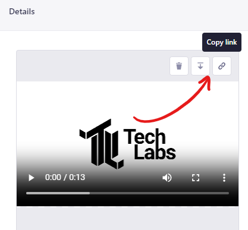

## Responsibilities

* Project Leaders are responsible with keeping the project information up to date.
* Lab Leaders are responsible for keeping their respective Lab pages up to date.
* If you as an Editor invite an Author you are responsible for quality controlling and publishing posts they draft.
* Every user is responsible for the information on their own person page.
* Every user is responsible for their own posts.

## Administration

Administrator documentation lives on the [github repository](https://github.com/arcada-uas/TechLabs-Website). Current users with administrator access to the CMS is, Alexander, Dennis, Heidi and Andrey.

## Writing posts for the website

We made this YouTube tutorial to help you get started creating content for the site.  
<https://www.youtube.com/watch?v=kP2fVblmNEQ>

This is a content creation guide, primarily over the markdown features supported on this site.

Link to content mgmt system - website content creation: <https://cms.techlabs.fi/>

### A note on image sizes

The space for the cover image is 1000x400px if you want to account for that. But the image will resize to cover the container.  
RichText images (images in your text) will resize to be contained in 1000x400px (if a need arise for a different size we can discuss it).  
Cover image for lab profiles is 800x400px

### Basic Markdown

| **Element**                                                                              | **Markdown syntax**                                         |
|--------------------------------------------------------------------------------------|---------------------------------------------------------|
| Heading                                                                              | \# H1 <br /> ## H2 <br /> ### H3                         |
| Bold Text                                                                            | \*\*bold text\*\*                                           |
| Italic Text                                                                          | \*bold text*                                             |
| Block quote                                                                          | \> blockquote                                            |
| Ordered List                                                                         | 1\. First item <br />2\. Second item <br /> 3\. Third item |
| Unordered List                                                                       | \- First item <br />\- Second item <br />\- Third item     |
| Inline code                                                                          | \`code`                                                  |
| Horizontal rule                                                                      | \---                                                     |
| Link                                                                                 | \[title](https://www.example.com)                        |
| Image                                                                                | \                                               |
| Excape Markup <br /> (useful to show the source of markdown instead of rendering it) | \\                                                       |

### Extended features

| Element           | Markdown Syntax                                                                            |
|-------------------|--------------------------------------------------------------------------------------------|
| Table             | \| Syntax                                                                                  |
| Fenced code block | \`\`\`language <br /> code <br /> \`\`\`                                                         |
| Footnote          | Here's a sentence with a footnote. \[^1] <br /> <br />[^1]: This is the footnote.           |
| Task List         | \- \[x] Write the press release <br />\- \[ ] Update the website <br />\- \[ ] Contact the media |
| Subscript         | <sub>text</sub>                                                                            |
| Superscript       | <sup>text</sup>                                                                            |

### KaTex: The LaTex of the web

Make sure to validate your katex because it will crash silently without explaining to you why.

The [katex website](https://katex.org/) has a validator on their frontpage where you can test your formulas.

here you can find the full list of [supported katex features](https://katex.org/docs/supported.html)

| Element      | Markdown Syntax                                                             |
|--------------|-----------------------------------------------------------------------------|
| inline katex | $ katex $                                                                   |
| display mode | $$ <br /> katex <br /> $$                                                   |
| example      | $$ <br /> \\lim\\limits\_{h \\rightarrow 0} \\dfrac{f(a + h) - f(a)}{h} <br />$$ |

### Code block extra features

All the languages supported can be found [here](https://prismjs.com/#supported-languages)

| Element                                                   | Markdown Syntax                                                      |
|-----------------------------------------------------------|----------------------------------------------------------------------|
| line numbering                                            | \`\`\`javascript{numberLines: true} <br />*code...*                       |
| start line numbering at number                            | \`\`\`javascript{numberLines: 20} <br /> *code...*                        |
| line highlighting <br /> highlight line 1 and line 4 to 6 | \`\`\`javascript{1,4-6} <br /> *code...*                                  |
| alternative highlighting                                  | console.log("hi") // highlight-line                                  |
| line numbering and highlighting                           | \`\`\`javascript{1,4-6}{numberLines: true} <br /> *code...*               |
| shell prompt <br /> only triggers on bash and shell       | \`\`\`shell{outputLines: 2-10,12}<br /> *code...*                         |
| shell prompt                                              | \`\`\`shell{promptUser: alice}{promptHost: dev.localhost}<br /> *code...* |
| diff                                                      | \`\`\`diff-javascript <br /> *code...*                                    |
| file name / title                                         | \`\`\`javascript:title=example-file.js <br />*code...*                    |

## Adding videos to blogposts

Upload your video to the **Media Library** in Strapi. To get the link to your video click the **Copy Link** button when your media has finished uploading *(OBS. Strapi adds a hash to the end of your filename so this step is not optional)*.



HTML is supported directly in the text so you can add a video by adding the following code block to your post.  Remember to add a title for accessibility and replacing *techlabs_logo_8ad5822cbb.mp4*  with the appropriate part of the link you Copied Link.

```
<video controls title="Silent animation of the techlabs logo">
    <source src="/uploads/techlabs_logo_8ad5822cbb.mp4" type="video/mp4">
</video>
```

## Responsibilities

* Project Leaders are responsible with keeping the project information up to date.
* Lab Leaders are responsible for keeping their respective Lab pages up to date.
* If you as an Editor invite an Author you are responsible for quality controlling and publishing posts they draft.
* Every user is responsible for the information on their own person page.
* Every user is responsible for their own posts.

## Administration

Administrator documentation lives on the [github repository](https://github.com/arcada-uas/TechLabs-Website). Current users with administrator access to the CMS is, Alexander, Dennis, Heidi and Andrey.

## Writing posts for the website

We made this YouTube tutorial to help you get started creating content for the site.  
<https://www.youtube.com/watch?v=kP2fVblmNEQ>

This is a content creation guide, primarily over the markdown features supported on this site.

Link to content mgmt system - website content creation: <https://cms.techlabs.fi/>

### A note on image sizes

The space for the cover image is 1000x400px if you want to account for that. But the image will resize to cover the container.  
RichText images (images in your text) will resize to be contained in 1000x400px (if a need arise for a different size we can discuss it).  
Cover image for lab profiles is 800x400px

### Basic Markdown

| **Element**                                                                              | **Markdown syntax**                                         |
|--------------------------------------------------------------------------------------|---------------------------------------------------------|
| Heading                                                                              | \# H1 <br /> ## H2 <br /> ### H3                         |
| Bold Text                                                                            | \*\*bold text\*\*                                           |
| Italic Text                                                                          | \*bold text*                                             |
| Block quote                                                                          | \> blockquote                                            |
| Ordered List                                                                         | 1\. First item <br />2\. Second item <br /> 3\. Third item |
| Unordered List                                                                       | \- First item <br />\- Second item <br />\- Third item     |
| Inline code                                                                          | \`code`                                                  |
| Horizontal rule                                                                      | \---                                                     |
| Link                                                                                 | \[title](https://www.example.com)                        |
| Image                                                                                | \                                               |
| Excape Markup <br /> (useful to show the source of markdown instead of rendering it) | \\                                                       |

### Extended features

| Element           | Markdown Syntax                                                                            |
|-------------------|--------------------------------------------------------------------------------------------|
| Table             | \| Syntax                                                                                  |
| Fenced code block | \`\`\`language <br /> code <br /> \`\`\`                                                         |
| Footnote          | Here's a sentence with a footnote. \[^1] <br /> <br />[^1]: This is the footnote.           |
| Task List         | \- \[x] Write the press release <br />\- \[ ] Update the website <br />\- \[ ] Contact the media |
| Subscript         | <sub>text</sub>                                                                            |
| Superscript       | <sup>text</sup>                                                                            |

### KaTex: The LaTex of the web

Make sure to validate your katex because it will crash silently without explaining to you why.

The [katex website](https://katex.org/) has a validator on their frontpage where you can test your formulas.

here you can find the full list of [supported katex features](https://katex.org/docs/supported.html)

| Element      | Markdown Syntax                                                             |
|--------------|-----------------------------------------------------------------------------|
| inline katex | $ katex $                                                                   |
| display mode | $$ <br /> katex <br /> $$                                                   |
| example      | $$ <br /> \\lim\\limits\_{h \\rightarrow 0} \\dfrac{f(a + h) - f(a)}{h} <br />$$ |

### Code block extra features

All the languages supported can be found [here](https://prismjs.com/#supported-languages)

| Element                                                   | Markdown Syntax                                                      |
|-----------------------------------------------------------|----------------------------------------------------------------------|
| line numbering                                            | \`\`\`javascript{numberLines: true} <br />*code...*                       |
| start line numbering at number                            | \`\`\`javascript{numberLines: 20} <br /> *code...*                        |
| line highlighting <br /> highlight line 1 and line 4 to 6 | \`\`\`javascript{1,4-6} <br /> *code...*                                  |
| alternative highlighting                                  | console.log("hi") // highlight-line                                  |
| line numbering and highlighting                           | \`\`\`javascript{1,4-6}{numberLines: true} <br /> *code...*               |
| shell prompt <br /> only triggers on bash and shell       | \`\`\`shell{outputLines: 2-10,12}<br /> *code...*                         |
| shell prompt                                              | \`\`\`shell{promptUser: alice}{promptHost: dev.localhost}<br /> *code...* |
| diff                                                      | \`\`\`diff-javascript <br /> *code...*                                    |
| file name / title                                         | \`\`\`javascript:title=example-file.js <br />*code...*                    |

## Adding videos to blogposts

Upload your video to the **Media Library** in Strapi. To get the link to your video click the **Copy Link** button when your media has finished uploading *(OBS. Strapi adds a hash to the end of your filename so this step is not optional)*.


HTML is supported directly in the text so you can add a video by adding the following code block to your post.  Remember to add a title for accessibility and replacing *techlabs_logo_8ad5822cbb.mp4*  with the appropriate part of the link you Copied Link.

```
<video controls title="Silent animation of the techlabs logo">
    <source src="/uploads/techlabs_logo_8ad5822cbb.mp4" type="video/mp4">
</video>
```

## Responsibilities

* Project Leaders are responsible with keeping the project information up to date.
* Lab Leaders are responsible for keeping their respective Lab pages up to date.
* If you as an Editor invite an Author you are responsible for quality controlling and publishing posts they draft.
* Every user is responsible for the information on their own person page.
* Every user is responsible for their own posts.

## Administration

Administrator documentation lives on the [github repository](https://github.com/arcada-uas/TechLabs-Website). Current users with administrator access to the CMS is, Alexander, Dennis, Heidi and Andrey.

## Writing posts for the website

We made this YouTube tutorial to help you get started creating content for the site.  
<https://www.youtube.com/watch?v=kP2fVblmNEQ>

This is a content creation guide, primarily over the markdown features supported on this site.

Link to content mgmt system - website content creation: <https://cms.techlabs.fi/>

### A note on image sizes

The space for the cover image is 1000x400px if you want to account for that. But the image will resize to cover the container.  
RichText images (images in your text) will resize to be contained in 1000x400px (if a need arise for a different size we can discuss it).  
Cover image for lab profiles is 800x400px

### Basic Markdown

| **Element**                                                                              | **Markdown syntax**                                         |
|--------------------------------------------------------------------------------------|---------------------------------------------------------|
| Heading                                                                              | \# H1 <br /> ## H2 <br /> ### H3                         |
| Bold Text                                                                            | \*\*bold text\*\*                                           |
| Italic Text                                                                          | \*bold text*                                             |
| Block quote                                                                          | \> blockquote                                            |
| Ordered List                                                                         | 1\. First item <br />2\. Second item <br /> 3\. Third item |
| Unordered List                                                                       | \- First item <br />\- Second item <br />\- Third item     |
| Inline code                                                                          | \`code`                                                  |
| Horizontal rule                                                                      | \---                                                     |
| Link                                                                                 | \[title](https://www.example.com)                        |
| Image                                                                                | \                                               |
| Excape Markup <br /> (useful to show the source of markdown instead of rendering it) | \\                                                       |

### Extended features

| Element           | Markdown Syntax                                                                            |
|-------------------|--------------------------------------------------------------------------------------------|
| Table             | \| Syntax                                                                                  |
| Fenced code block | \`\`\`language <br /> code <br /> \`\`\`                                                         |
| Footnote          | Here's a sentence with a footnote. \[^1] <br /> <br />[^1]: This is the footnote.           |
| Task List         | \- \[x] Write the press release <br />\- \[ ] Update the website <br />\- \[ ] Contact the media |
| Subscript         | <sub>text</sub>                                                                            |
| Superscript       | <sup>text</sup>                                                                            |

### KaTex: The LaTex of the web

Make sure to validate your katex because it will crash silently without explaining to you why.

The [katex website](https://katex.org/) has a validator on their frontpage where you can test your formulas.

here you can find the full list of [supported katex features](https://katex.org/docs/supported.html)

| Element      | Markdown Syntax                                                             |
|--------------|-----------------------------------------------------------------------------|
| inline katex | $ katex $                                                                   |
| display mode | $$ <br /> katex <br /> $$                                                   |
| example      | $$ <br /> \\lim\\limits\_{h \\rightarrow 0} \\dfrac{f(a + h) - f(a)}{h} <br />$$ |

### Code block extra features

All the languages supported can be found [here](https://prismjs.com/#supported-languages)

| Element                                                   | Markdown Syntax                                                      |
|-----------------------------------------------------------|----------------------------------------------------------------------|
| line numbering                                            | \`\`\`javascript{numberLines: true} <br />*code...*                       |
| start line numbering at number                            | \`\`\`javascript{numberLines: 20} <br /> *code...*                        |
| line highlighting <br /> highlight line 1 and line 4 to 6 | \`\`\`javascript{1,4-6} <br /> *code...*                                  |
| alternative highlighting                                  | console.log("hi") // highlight-line                                  |
| line numbering and highlighting                           | \`\`\`javascript{1,4-6}{numberLines: true} <br /> *code...*               |
| shell prompt <br /> only triggers on bash and shell       | \`\`\`shell{outputLines: 2-10,12}<br /> *code...*                         |
| shell prompt                                              | \`\`\`shell{promptUser: alice}{promptHost: dev.localhost}<br /> *code...* |
| diff                                                      | \`\`\`diff-javascript <br /> *code...*                                    |
| file name / title                                         | \`\`\`javascript:title=example-file.js <br />*code...*                    |

## Adding videos to blogposts

Upload your video to the **Media Library** in Strapi. To get the link to your video click the **Copy Link** button when your media has finished uploading *(OBS. Strapi adds a hash to the end of your filename so this step is not optional)*.


HTML is supported directly in the text so you can add a video by adding the following code block to your post.  Remember to add a title for accessibility and replacing *techlabs_logo_8ad5822cbb.mp4*  with the appropriate part of the link you Copied Link.

```
<video controls title="Silent animation of the techlabs logo">
    <source src="/uploads/techlabs_logo_8ad5822cbb.mp4" type="video/mp4">
</video>
```

## Responsibilities

* Project Leaders are responsible with keeping the project information up to date.
* Lab Leaders are responsible for keeping their respective Lab pages up to date.
* If you as an Editor invite an Author you are responsible for quality controlling and publishing posts they draft.
* Every user is responsible for the information on their own person page.
* Every user is responsible for their own posts.

## Administration

Administrator documentation lives on the [github repository](https://github.com/arcada-uas/TechLabs-Website). Current users with administrator access to the CMS is, Alexander, Dennis, Heidi and Andrey.

## Writing posts for the website

We made this YouTube tutorial to help you get started creating content for the site.  
<https://www.youtube.com/watch?v=kP2fVblmNEQ>

This is a content creation guide, primarily over the markdown features supported on this site.

Link to content mgmt system - website content creation: <https://cms.techlabs.fi/>

### A note on image sizes

The space for the cover image is 1000x400px if you want to account for that. But the image will resize to cover the container.  
RichText images (images in your text) will resize to be contained in 1000x400px (if a need arise for a different size we can discuss it).  
Cover image for lab profiles is 800x400px

### Basic Markdown

| **Element**                                                                              | **Markdown syntax**                                         |
|--------------------------------------------------------------------------------------|---------------------------------------------------------|
| Heading                                                                              | \# H1 <br /> ## H2 <br /> ### H3                         |
| Bold Text                                                                            | \*\*bold text\*\*                                           |
| Italic Text                                                                          | \*bold text*                                             |
| Block quote                                                                          | \> blockquote                                            |
| Ordered List                                                                         | 1\. First item <br />2\. Second item <br /> 3\. Third item |
| Unordered List                                                                       | \- First item <br />\- Second item <br />\- Third item     |
| Inline code                                                                          | \`code`                                                  |
| Horizontal rule                                                                      | \---                                                     |
| Link                                                                                 | \[title](https://www.example.com)                        |
| Image                                                                                | \                                               |
| Excape Markup <br /> (useful to show the source of markdown instead of rendering it) | \\                                                       |

### Extended features

| Element           | Markdown Syntax                                                                            |
|-------------------|--------------------------------------------------------------------------------------------|
| Table             | \| Syntax                                                                                  |
| Fenced code block | \`\`\`language <br /> code <br /> \`\`\`                                                         |
| Footnote          | Here's a sentence with a footnote. \[^1] <br /> <br />[^1]: This is the footnote.           |
| Task List         | \- \[x] Write the press release <br />\- \[ ] Update the website <br />\- \[ ] Contact the media |
| Subscript         | <sub>text</sub>                                                                            |
| Superscript       | <sup>text</sup>                                                                            |

### KaTex: The LaTex of the web

Make sure to validate your katex because it will crash silently without explaining to you why.

The [katex website](https://katex.org/) has a validator on their frontpage where you can test your formulas.

here you can find the full list of [supported katex features](https://katex.org/docs/supported.html)

| Element      | Markdown Syntax                                                             |
|--------------|-----------------------------------------------------------------------------|
| inline katex | $ katex $                                                                   |
| display mode | $$ <br /> katex <br /> $$                                                   |
| example      | $$ <br /> \\lim\\limits\_{h \\rightarrow 0} \\dfrac{f(a + h) - f(a)}{h} <br />$$ |

### Code block extra features

All the languages supported can be found [here](https://prismjs.com/#supported-languages)

| Element                                                   | Markdown Syntax                                                      |
|-----------------------------------------------------------|----------------------------------------------------------------------|
| line numbering                                            | \`\`\`javascript{numberLines: true} <br />*code...*                       |
| start line numbering at number                            | \`\`\`javascript{numberLines: 20} <br /> *code...*                        |
| line highlighting <br /> highlight line 1 and line 4 to 6 | \`\`\`javascript{1,4-6} <br /> *code...*                                  |
| alternative highlighting                                  | console.log("hi") // highlight-line                                  |
| line numbering and highlighting                           | \`\`\`javascript{1,4-6}{numberLines: true} <br /> *code...*               |
| shell prompt <br /> only triggers on bash and shell       | \`\`\`shell{outputLines: 2-10,12}<br /> *code...*                         |
| shell prompt                                              | \`\`\`shell{promptUser: alice}{promptHost: dev.localhost}<br /> *code...* |
| diff                                                      | \`\`\`diff-javascript <br /> *code...*                                    |
| file name / title                                         | \`\`\`javascript:title=example-file.js <br />*code...*                    |

## Adding videos to blogposts

Upload your video to the **Media Library** in Strapi. To get the link to your video click the **Copy Link** button when your media has finished uploading *(OBS. Strapi adds a hash to the end of your filename so this step is not optional)*.


HTML is supported directly in the text so you can add a video by adding the following code block to your post.  Remember to add a title for accessibility and replacing *techlabs_logo_8ad5822cbb.mp4*  with the appropriate part of the link you Copied Link.

```
<video controls title="Silent animation of the techlabs logo">
    <source src="/uploads/techlabs_logo_8ad5822cbb.mp4" type="video/mp4">
</video>
```