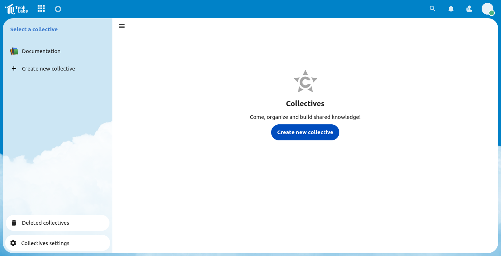
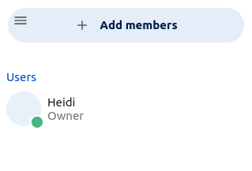

# Using collectives

Collectives is a great way to share manuals and documentation within the organization or team.

## Create a new collective

1. Click on "Create a new collective" and give the collective a name.
2. You can start editing by pressing the "Edit" button in the right side of the page.

## Adding a page

1. Click on the plus (+) next to the name of your collective.
2. A new page will automatically be created. You can rename it by editing the page and you can **reorder the pages** by dragging and dropping.

## Adding people to your collective

1. Click on the three dots (...) next to the name of your collective and select "Manage members". It will take you to the "Contacts" page.
2. Click on the "Add member" button and type in whom you'd like to add. You can now add users, groups, circles and emails.
3. Click on the "Add to ..." button.
4. Here you can also manage and restrict the membership and visibility.

   