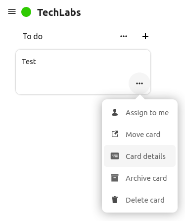
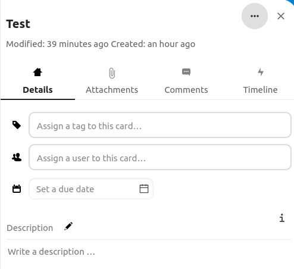
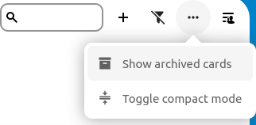
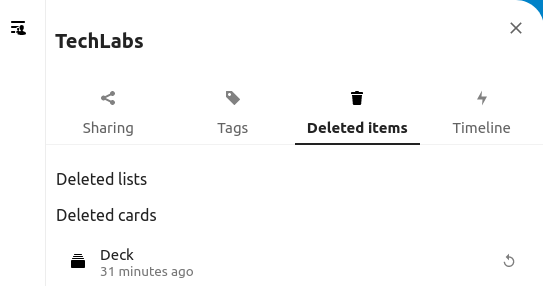
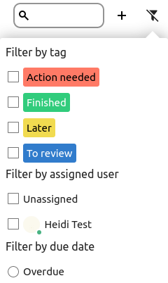

# Using the deck app

The Deck app can be used as a task management tool within your organization or a group.

## Main board

The **TechLabs General board** is visible for all users in TechLabs and will be the main board used to see the progress and task tracking.

## **What boards can I see?**

Based on the team you are in you will see also the team specific boards (Afora, Arogs. Cassiopeia, Demos, Märi, Profi WP3, Tafidiai and TechLabs Website). Only the members in a specific group can see the specific board. You will already be added to groups by the TechLabs admin based on the project you are working on.

You will also have a **Personal board** which is only visible to you and a great way to keep track of your personal tasks.

## Cards

### Creating a card

1. Go to the board you want to create a card in, choose the right list (e.g. "To do", "Doing" or "Done") and click on the plus (+) sign to the right of the list name.
2. Give the card a name, press enter or click on the arrow.
3. Assign the card a tag or user if you like

### Assigning the cards

1. Click on the card or click on the three dots (...) in the right down corner and select the "Card details".

   
2. In the "Details" you can assign the card a tag or a user by clicking either the "Assign a tag to this card..." or "Assign a user to this card..." field. Select the right tag or user by clicking on it. You can also choose a due date and write a description.
3. In the "Attachments" you can add files to a card.

**💡 Tips**: Change the view to a **sidebar view** by clicking a card, in the right upper corner click on the three dots (...) and select " Open in sidebar view". After this the card details will always appear in the right side of your page.

### Attachments to cards

You can upload attachments to cards.

1. Go to the card details by clicking the card, then go to the " Attachments".
2. Click on the "Upload new files" to upload from your computer.
3. Click on "Share from Files" to upload from the files in your NextCloud.

### Upcoming cards

You can see the upcoming cards in your dashboard or in the Deck app under "Upcoming cards" in the left upper corner.

### Archiving cards

For cards that no longer need to be seen on the board but you don't want to delete is archiving a good option.

**Archiving a card:**

1. Go to the card and click on the three dots (...) in the right down corner of the card.
2. Select "Archive card" and the card will disappear from the board.

**Archiving all cards in a list:**

1. Go to the list and click on the three dots (...) next to the name of the list.
2. Select "Archive all cards" and all the cards in the list will be archived.

**Show archived cards:**

1. Go to the board and click on the three dots (...) in the upper right corner.
2. Click on the "Show archived cards" and a board with archived cards will appear.
3. To go back to the actual board click on the three dots (...) again in the upper right corner and select "Hide archived cards".

   

### Restoring a deleted card or list

1. Go to the board you want to restore an item.
2. Click on the "Details" icon in the right upper corner under your profile and go to "Deleted items".
3. Click on the "Undo" arrow next to the name of the list or the card and it will appear in the board.
4. If you restore a list the cards that were on the list will be restored as well.

   

### Moving cards between boards

If you decide to move a card from a board remember that it will disappear from the board you are moving it from.

1. Go to the card you would like to move and click on the three dots (...) in the right down corner of the card. Select "Move card".
2. Now select a board and then select a list and click on the "Move card" button in the right down corner and it will appear in the selected board.

## Boards

### Creating a list

1. Go to the board you would like to create a new list. Click on the plus sign (+) in the upper right corner of the board next to the search field.
2. Give the list a name and press enter or click on the arrow next to the field and the list will appear in your board.
3. You can reorder the list by dragging it into the order you want.

### Filtering a board

If you want to filter a board based on a certain tag, a user or timeline.

1. Go to the board you would like to filter and click on the "Filter" icon in the right upper corner between the plus (+) sign and the three dots (...).
2. Choose the filters you like to use (tags, assigned users or due date) and the board will update.
3. Clear all filters to go back to the original board.

   