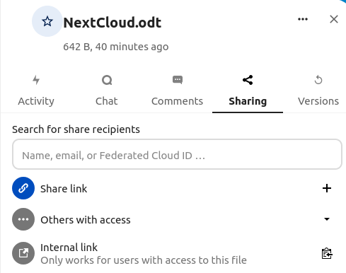

In Nextcloud you can create, preview, edit, delete, share, and re-share files. Since we start small scale most of the files will still be shared on Teams and saved on other cloud platforms until fully implemented.

# Upload a file

1. Click on the plus (+) sign in the upper left side of the page.
2. Choose "Upload file" and select the right file on your computer.
3. The file is added to your files.

# Create a file

1. Click on the plus (+) sign in the upper left side of the page.
2. Click on the right format (New text file, New Document, New spreadsheet, New presentation, New diagram)
3. Give the file a name and press enter or click on the arrow.

   
4. Pick a template by clicking on it and then click on the "Create" button.

# Edit files

If you want to rename, download, delete files or add a file to favorites press the tree dots (...).

# Adding a tag

Adding tags to a file or folder.

1. Go to the file or folder you would like to tag and click on the share button on the right side.

   
2. From the view that pops up on the right side of the screen, click on the tree dots (...) in the upper right corner.
3. Click on " Tags"

   
4. Choose the right tag in the list by clicking it, or write a new tag.
5. In [Tags](../Tags.md) you can read about how you can **search for files with a specific tag**

# Share files

You have several ways to share files: public links, to users, groups, circles or in talk conversations.

Go to the file or folder you would like to share, click on the share icon to the right of the file name and this view should pop up on the right side of your screen:

### Public links

1. Go to "Share link" and click on the plus (+) to create a new link.
2. By clicking on the three dots (...) you can choose the restrictions for the file/folder that is being shared or unshare.
3. "Add another link" is for creating multiple links with different rights.

   The created link should automatically copy the link to your clipboard, but you can copy it again by clicking the "Copy to clipboard" icon to the left of the tree dots (...) .

   

   ### Users, groups, circles or any email
   1. Go to "Search for share recipients" and type in the name of a user, group or a circle and click on it and it will appear under the "Share link" option.
   2. You can also type in any email address in the form of "name@example.com" and share the content with them.
   3. By clicking on the three dots (...) next to the name of the user, group or circle you can choose the restrictions for the file/folder that is being shared or to unshare.

      