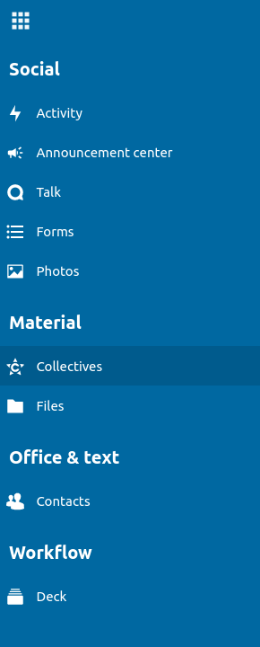

# Nextcloud apps

Apps are functions that are used in NextCloud. You can find your apps by clicking the "App selection menu" in the upper left corner next to the logo. These are the apps available to you:

* **Activity**: enables users to view actions related to their files in Nextcloud, such as create, tag and modify files or changes to groups.
* **Announcement center**: For making announcements such as introduce a new colleague or make sure everyone knows about the big event next month.
* **Talk**: A simple text chat. Allowing you to share files from your Nextcloud and mentioning other participants.
* **Forms** : For simple surveys and questionnaires.
* **Photos**: For media and collaborative albums.
* **Collectives**: For creating documentation to easily share knowledge.
* **Files**: For sharing and storing files.
* **Contacts**: For gathering contacts.
* **Deck**: A kanban style organization tool aimed at personal planning and project organization for teams.

In this manual we will get you started on the basic usage of the following apps:

[Files](Files.md) - File sharing

[Collectives](Collectives.md) - Notes

[Talk](Talk.md) - Chat

[Deck](Deck%20(retired).md) - Task management tool