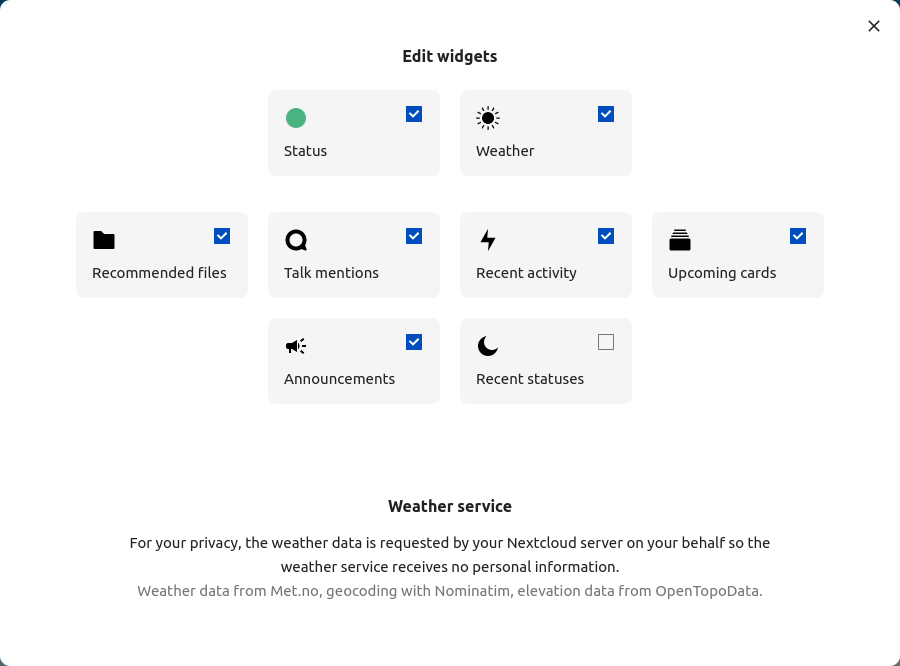

# Navigating the main user interface

When you log in to Nextcloud you will come to your dashboard. Let's take a look at what this interface contains and then customize the view.

**Logo (1)** : In the upper left corner. The TechLabs logo will take you to the dashboard.

**App Selection Menu (2):** Here you can find all the apps available to you.

**Dashboard icon (3):** The dashboard icon will take you to the dashboard.

**Search (4):** By clicking the magnifier icon in the upper right corner you can search for e.g. files, tags or apps.

**Notifications (5):** By clicking the notification bell you can see your notifications.

**Contacts (6):** By clicking the contacts menu, you can search for contacts, go to profile or directly send an email to another user or start talking in the [Talk-chat](Apps/Talk.md?fileId=1518).

**Profile (7)**: By clicking on your profile picture you find your Settings dropdown menu.

**Application view (8):** This field displays the content or app you have selected to view.

# Customize your dashboard

In the dashboard view click on the "Customize" button in the center bottom of the page. Click on "Recent activity", "Upcoming cards" and "Announcements" to get more and important content on your dashboard.

