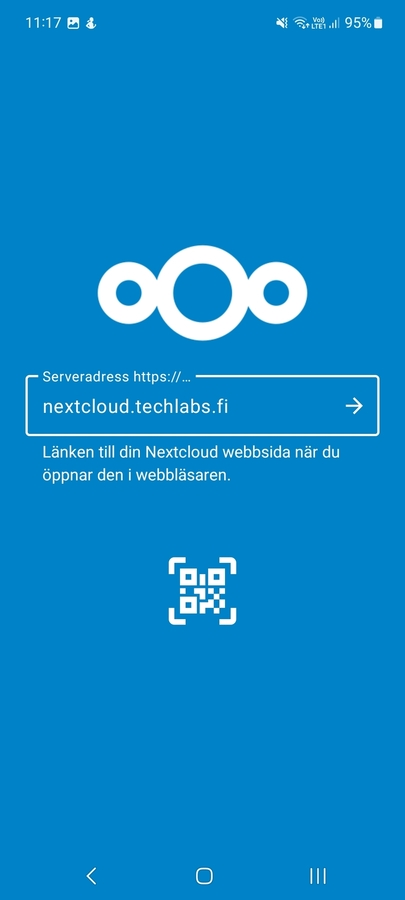
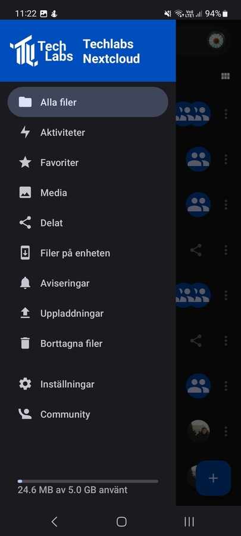

# How to get NextCloud to your mobile

Stay uptodate by also having your NextCloud on your mobile.

## Set up NextCloud app

### **Download app**

Go to your appstore and install NextCloud.

### **Log in**

1. Open the app and click on "Log in" (Logga in)

   
2. Type in the "Serveradress" field the TechLabs server adress: nextcloud.techlabs.fi

   
3. Log in with your NextCloud account.

   
4. After you've logged in with your account click "Grant access" and you are ready to use your NextCloud app.

   