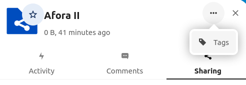
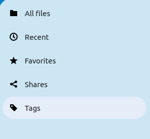
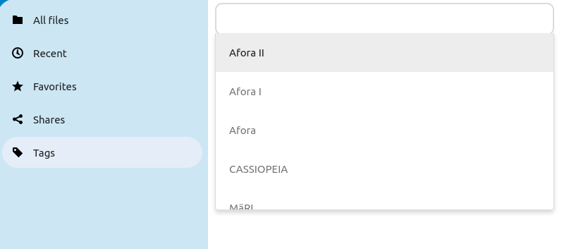

# Purpose of tags

Tags are used to better filter different content on the apps like in [Files](./Apps/Files.md) or assign tasks in [Deck](./Apps/Deck%20(retired).md).

## Adding tags to files or folders

1. Go to the file you would like to tag and click on the share icon to the right of the name of the file/folder
2. Click on the three dots (...) in the upper right corner and select tags.

   
3. Click on the "Collaborative tags" and type in a new tag, search for a tag or click on the tag in the dropdown menu to add a tag.

## Adding a tag to a deck card

1. Go to the card you would like to assign a tag to and click on the card or click on the three dots (...) in the right down corner of the card and select "Card details".

   
2. Now click on the "Assign a tag to this card..." and click on the right tags such as "Demos" and "To review". Here you can also assign the card to a specific user.
3. To **delete** a tag, just click on the tag again and it will be removed.

## Search for files with a specific tag

1. Open the Files app, in the menu on the left click on "Tags".

   
2. In the "Select tags to filter by" section type in a tag you want to filter by. You can choose multiple tags. Tagged files will appear below.

   