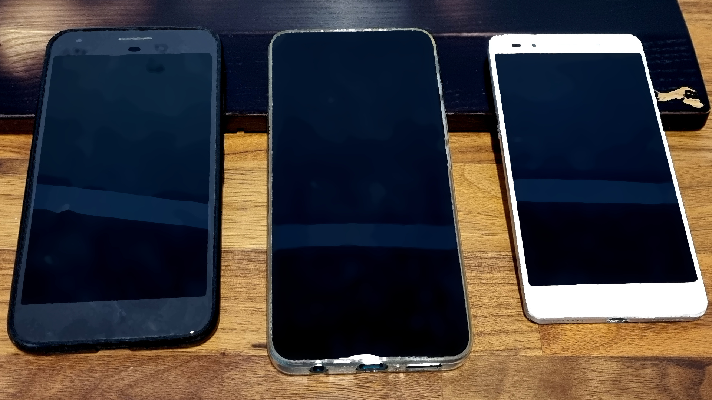

## Phones

Techlabs has several phones available. The focus of these phones is to experiment and research with opensource modules and distributions for phones, the sole deviation is the Honor Phone used for controlling the 🤖 [Robot](../../Robots/Alf/Readme.md) Alf with the Q-link application.

## Tablets

Currently there is a few Samsung Galaxy S6 Lite available at Techlabs. 1 is specific for the 🤖 [Robot](../../Robots/Amy%20&%20Alex/Readme.md) Alex and the rest are available for opensource or other projects.

## Open-source

When we speak of open-source tablets we tend to mean specific open-source variations of the Android operating system, for example [LinageOS](https://lineageos.org/). Also we tend to promote open-source alternatives to Googles Playstore like [F-Droid](https://f-droid.org/en/). These tools promote open, transparent and collaborative software that don't act intrusively on your phone and your privacy without your consent.