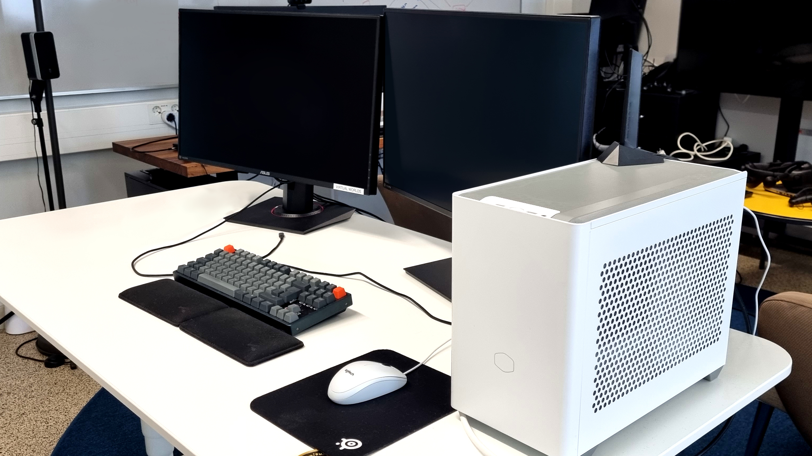

*Image of a standard Linux machine at Techlabs*

# Computers

::: info
*We are planing to acquire new computers under 2023! Stay tunned for an update.*

:::

There are plenty of computers available at Techlabs. The standard DevLab machines are old but use working Nvidia GPUs (4gb VRAM) and intel i5 with 16gb RAM. Storage varies from unit to unit but can usually be upgraded with spare drives if more space is needed.

Most computers run assorted distributions of Linux (commonly Ubuntu based) and are shared among users at Techlabs. Hence be mindful of storing and saving sensitive information. Preferably you'd keep any work related files securly on ☁️ [Nextcloud](../Software/NextCloud.md).

### NUCs

Next Unit of Computing, are some small-form-factor PCs available. These usually carry specific tasks and purposes (like being installed in one of our 🤖 [Robots](../../Robots/Snow/Readme.md)) but can fulfill other needs for specific projects as necessary. Make sure to consult an admin before use so no vital data is lost and proper backups are implemented before repurposing a NUC.

::: info
Be mindful that NUCs usually run less powerful CPUs and GPUs and with limited cooling. As such they are not as suitable for compute-heavy workloads when compared to a full desktop computer.

:::

*Image of an Intel NUC from the robot Snow*

### Virtual Reality & Machine Learning

*Image of a VR PC and dual monitor setup*

Currently 2 VR PCs are available at Techlabs. These machines run more powerful hardware and Windows 10 for VR compatability.

* AMD Ryzen 5800 CPU
* RTX 3080 (10gb) GPU
* 64GB ddr4 RAM

These machines are specifically built to enable Virtual Reality sessions however they also substitute well for Machine Learning tasks, as such one of the machines run a dual boot configuration. If you need access to either of these machines contact an admin.

::: warn
Due to the nature of running machine learning tasks; it is always best to check the computers activity before powering down; in case someone is remotely running a training session.

:::

*Varjo VR headset at Techlabs*

### Sensitive local files

If you must keep sensitive files locally there is a designated encrypted machine available with very limited access available through admins.

Sensitive files include, but are not limited too, interview recordings, voice recordings, observation recordings, datasets with personal data.

How and when to store sensitive data on a local computer is usually specified by your project leader in a separate contract with affected clients.

::: error
Currently (2023) the above computer chase stores sensitive data.

Do not tamper with. Seek admin approval if it must be relocated from its designated position.

:::