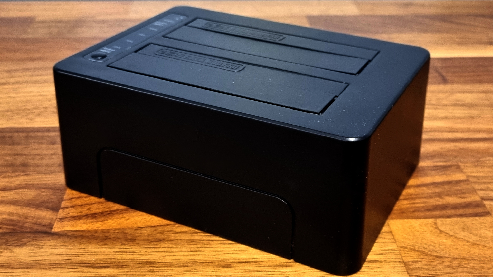
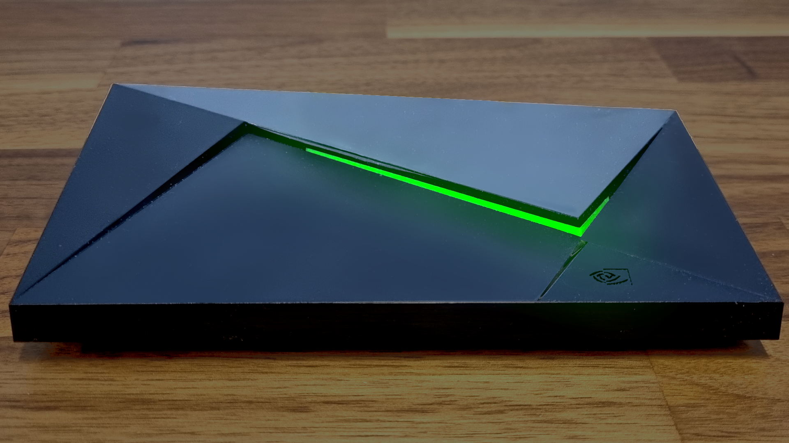
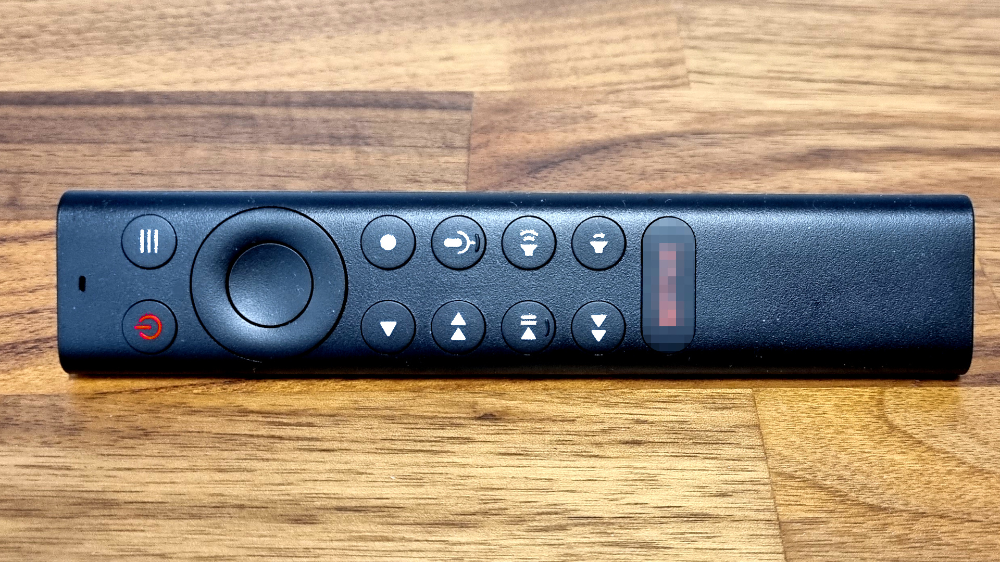
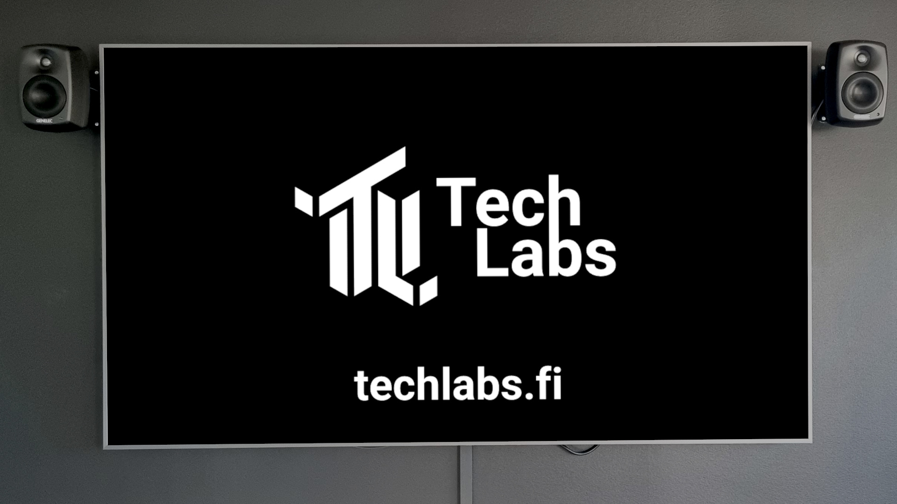
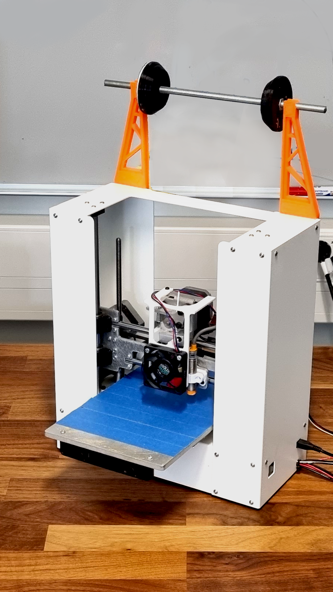
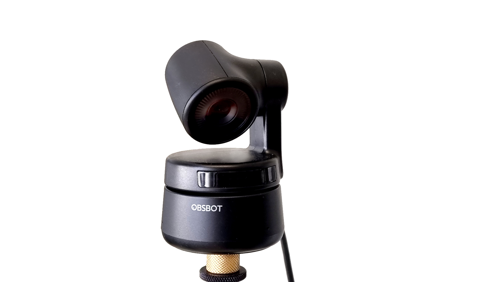
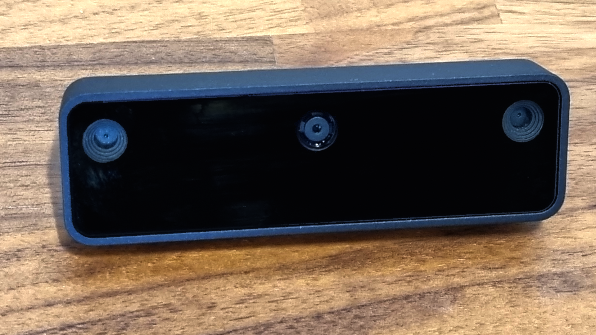

*Image of Harddrive Cloner at Techlabs*

# Techlabs general

There is plenty of hardware at Techlabs that doesn't need its own category, like the above Hardware cloner or USB sticks, Monitors etc. etc. Some of the more specific items can be found below but as Techlabs is part of Arcada chances are we have access to most standard IT tools, be sure to ask if you need something specific for your project or if you feel an item should be added to this collective!

### Table of content

* Nvidia Shield
* Screens
* Google Nest
* 3D Printer
* Smart Cameras

## Nvidia Shield

*Image of Nvidia Shield*

The Nvidia Shield is a streaming device built with Nvidias Tegra chipset for stronger AI up-scaling of video content. What makes the Nvidia Shield more special for research is it's open platform, here you can install many applications not usually available on other streaming devices (like a Chromecast), you can even run the Nvidia Shield as a server using Plex for example.

::: info
Official documentation can be found >[here](https://www.nvidia.com/en-us/shield/support/shield-tv/)<

:::

*Image of Nvidia Shield Remote*

## Screens

*Image of Samsung TV*

Plenty of monitors, tvs and screens are available. More special cases are available like the small Telefunken as a digital frame, the large CleverTouch presentation touch screen or the massive Samsung TVs mounted by the VR computers.

There tends to be a screen available for most use cases and events, so if your project has a need to display something come ask an admin and we'll get you sorted.

## Google Nest

Is a smart speaker by Google. It is mostly locked down with their proprietary software but used to control some of the Ikea smart lights, Trådfri, installed at Techlabs.

## 3D Printer

There is a 3D printer with filament available at Techlabs. Please be in contact with an admin on how to use it. For larger projects Arcada University of Applied Sciences also provides more advanced 3D printers from their workshop.

*Image of 3D printer*

## Smart Cameras

Techlabs has some more advanced web-cameras available like the OBSBOT camera that uses AI to follow the user or the OAK-D-Lite, a tiny computer vision AI camera able to recognize objects as a standalone AI.

*Image of Obsbot camera*

*Image of OAD-D-Lite*