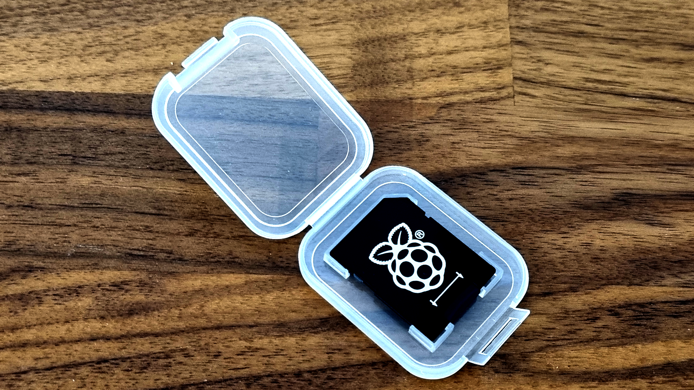
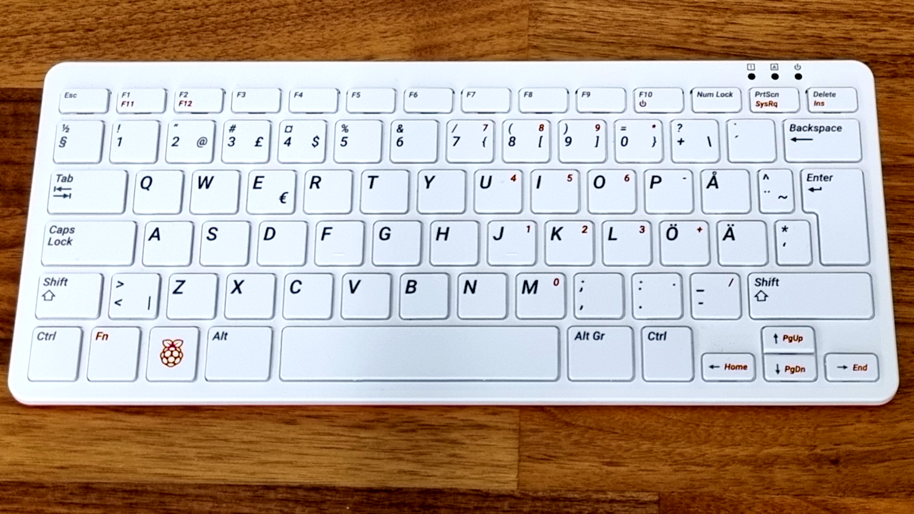
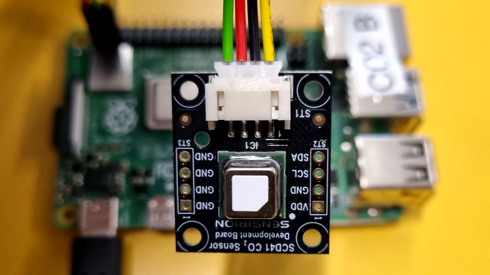
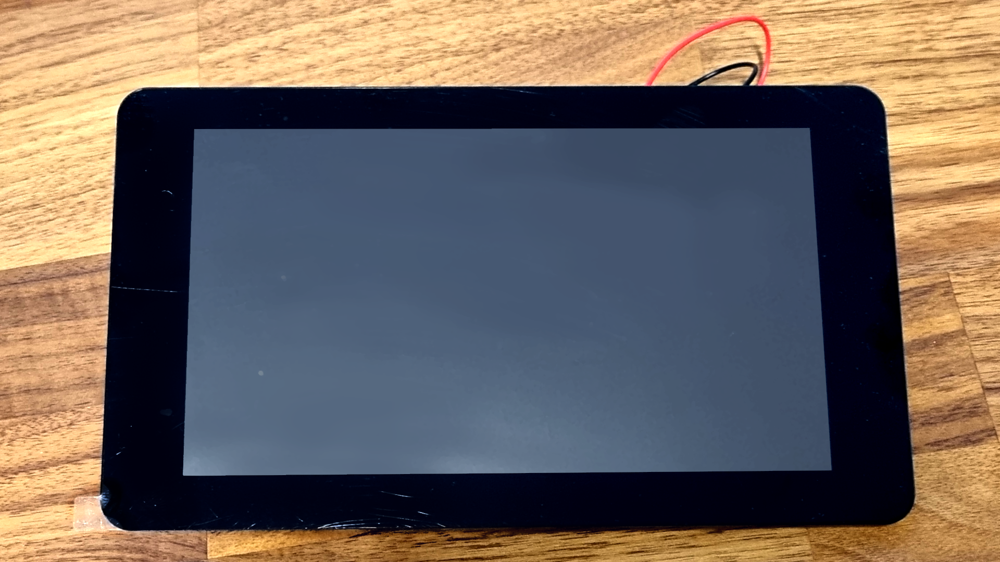
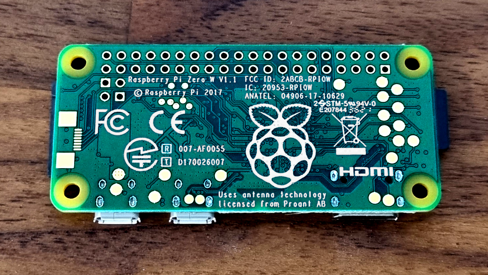

# Raspberry Pi

::: info
Official Raspberry Pi documentation can be found >[here](https://www.raspberrypi.com/documentation/)<

:::

At Techlabs we have several different models of Raspberry Pi. This document lists the available models and their common usecases.

Most are available for use in different projects, simply grab an unused micro-SD card and get your project up and going.

*Image of Micro-SD card inside adapter*

## Model 4B

*Raspberry Pi 4B*

Model 4B is the most powerful Raspberry Pi currently available at Techlabs. Most of them come with 4gb of RAM. Currently they are used for:

* [Mini Pupper](../../Robots/Mini%20Pupper/Readme.md)
* Nextcloud experiment

## Model 400

*Raspberry Pi 400*

* The model 400 is a Raspberry Pi 4B (4gb) mounted inside a keyboard.
* Works for any normal project or as a all-in-one pc.

## Model 3B

* The previous model of Raspberry Pi and most readily available.
* Works for most projects and is especially suitable for less taxing projects like monitoring using sensors or as interactive info screens.

*Humidity Sensor connected to a Raspberry Pi 3B*

## Pi Touchscreen

*Image of Raspberry Pi Official Touchscreen*

* There is **1** screen available at Techlabs.
* Works with Raspberry Pi 4B and 3B.

## Model Zero

*Raspberry Pi Zero W*

Model Zero W is a less powerful but smaller version with Bluetooth and Wireless capabilities.

* Commonly used as info-screens.
* Can be used to collect data streams with available sensors
* Not very suitable for computing power or media heavy user-interfaces

# 