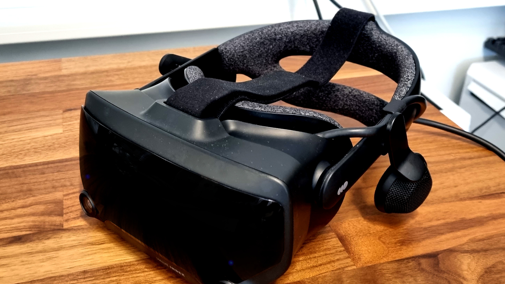
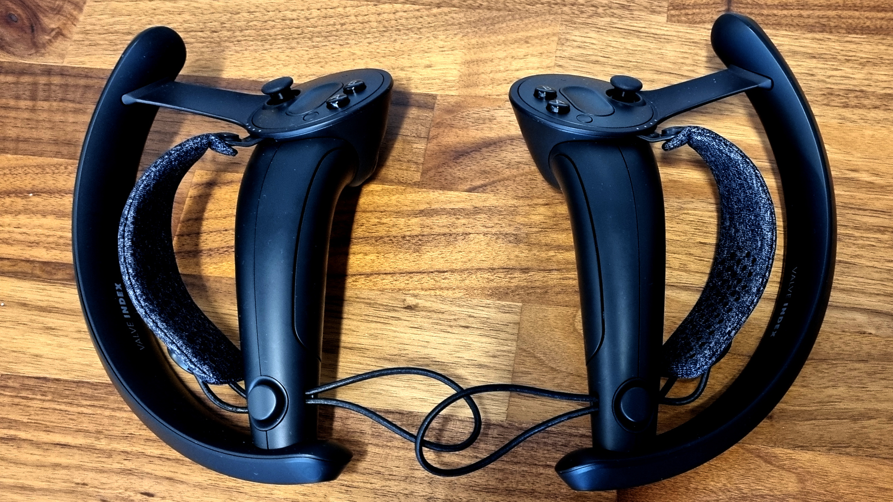
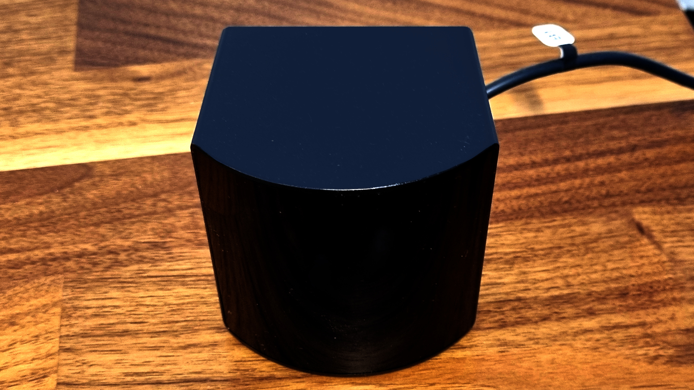
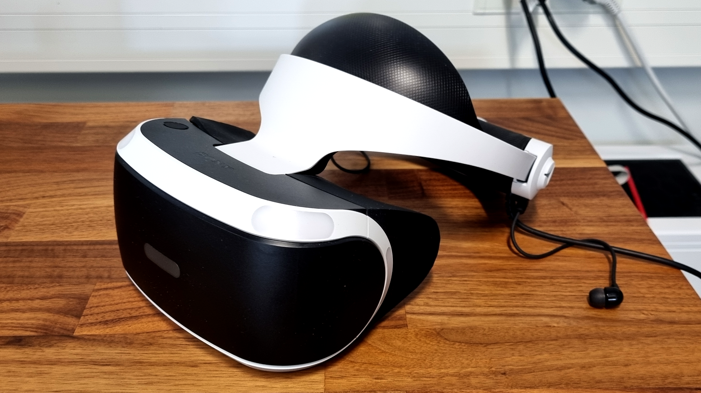
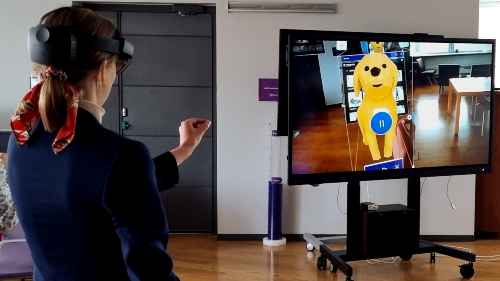

*Image of Valve Index virtual reality headset*

# Virtual reality

At Techlabs we do research in virtual reality for consumer learning, robot simulations and virtual interactions. To do this we obviously need virtual reality hardware and apart from 2 specific virtual reality 💻 [Computers](Computers.md?fileId=27143) we also have some virtual headsets.

* Valve Index
* Varjo VR 2
* Playstation VR
* Hololens 2

### Valve Index

*(Image available at the top of the document)*

::: info
Official get started available >[here](https://help.steampowered.com/en/faqs/view/7F7D-77FB-8CAA-4329)<

:::

The valve index functions as a high-end headset with higher resolution, refresh rate and field of view. The Valve Index comes with finger tracking controllers and user tracking stations.

*Image of Valve Index controllers*

*Image of Valve Index basestation*

The Valve Index headset serves as our go-to for virtual reality experiences.

### Varjo VR 2

::: info
Official get started documents >[here](https://varjo.com/use-center/get-started/varjo-headsets/setting-up-your-headset/connecting-vr/)<

:::

The Varjo virtual reality headset is a standalone headset that has eye-tracking, letting researchers collect statistical data on where a user looks. The headset has no controllers and connects via SteamVR software on the VR computer.

*Image of Varjo VR 2*

### Playstation VR

The 🕹️ [Gaming Console](Gaming%20Consoles.md) Playstation 4 has an easy to use VR Headset. The scope for research is limited but the headset works well for certain demos or for users to try out lighter VR activities to train themselves against VR sickness or fatigue.

::: info
Virtual reality sickness, or VR sickness occurs when exposure to a virtual environment causes symptoms that are similar to motion sickness symptoms. - Wikipedia

:::

*Image of Playstation VR*

## Hololens 2

While technically not a virtual reality the Hololens 2 available at Techlabs is a Microsoft made augmented reality headset, projecting virtual objects on the real world for users to interact with.

The Hololens 2 is breaking new and unexplored boundaries and as such any research suggestions for use with the Hololens 2 is much appriciated.

::: info
Learn more about Microsoft Hololens 2 at their official site >[here](https://www.microsoft.com/en-us/hololens/hardware#document-experiences)<

:::

*Staff from Arcada testing the Hololens 2 at a Techlabs event*