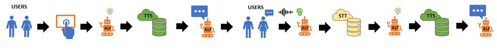

# Flossa

The flossa application was used for the MäRI project back in 2021 to instruct users on how to best use dental floss. The MäRI project has since finished but the application can still be found on our [GitHub repository](https://github.com/socbots) and Alf of course is still in TechLabs!

The main purpose of the Flossa application, apart from dentalfloss instructions, was to impliment custom ASR and TTS solutions on one of our robots. The flow on how we accomplished this can be seen in the image below.

If you wish to read more you can see the following [thesis work](https://www.theseus.fi/handle/10024/751415) or visit the [GitHub respository.](https://github.com/socbots)