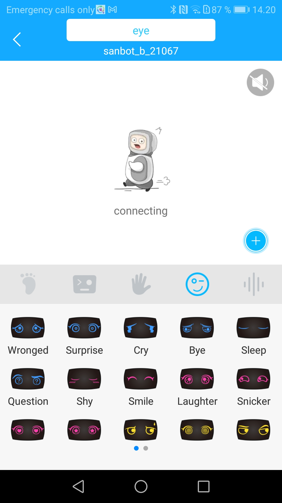

## Qlink

Qlink, provided by 🇨🇳 Sanbot, is a mobile application that can communicate over the web with Sanbot robots. The application accesses your Sanbot account's social information; like registered contacts or your registered bots. The application also provides access to most of the robots' external hardware such as the robot's camera, movements and facial expressions, but also a speech synthesis where an input field receives a text that the robot then plays as sound. The video playback that is available from the camera in the application has no sound but is otherwise a live broadcast.

The movements can be controlled by selecting body part (head, feet (wheels), right or left arm). All body parts can move up and down (forward/backward for the feet), in addition, the head and feet can rotate clockwise or counterclockwise. The head achieves a mobility of almost 180 degrees.

The facial expressions lack description but suggest simulating common emotions such as love, joy or sorrow. In total, there are 18 facial expressions with small animations such as pulsating hearts or flowing tears.

::: info
Qlink application is available on a Honor 8 Lite mobile phone at [Techlabs](../../../Onboarding/Hardware/Android%20Devices.md).

:::