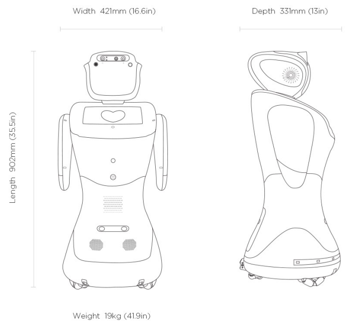
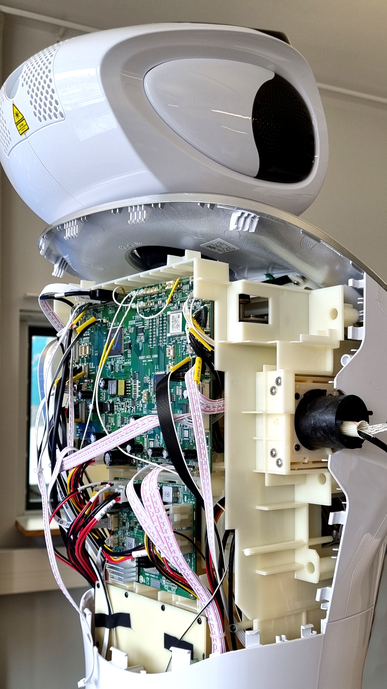
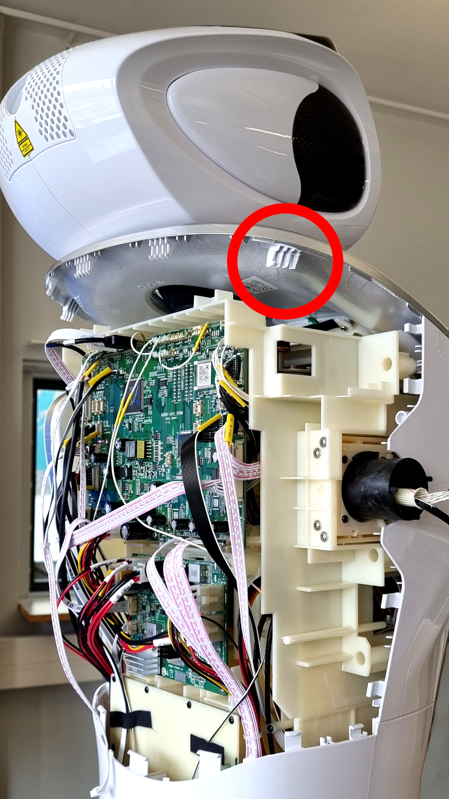

# 📣 Alf

The robot Elf, Techlabs Alf, was produced by 🇨🇳 Sanbot Innovation a high-tech Chinese company. Their goal is to break the barrier between traditions and new developments. With over 6 years in the industry and 200 💡 patents in technology, they are looking to develop more AI solutions (Sanbot Innovation Technology, 2018).

Sanbot collaborates with IBM Watson, Amazon Alexa and Nuance among others. They sell the robots from the Sanbot series, which includes Sanbot Elf, Sanbot Nano and Sanbot Max. The robots are mainly aimed at industries in 🏨  hotels, 🍽️ restaurants, 🚑 healthcare and 🎓 schools.

## 🔧 Hardware

For sensors, Alf has 7 microphones built into its head with two RGB cameras, 1 3D sensor and 7 touch sensors. On his body, Alf has 1 gyroscope sensor, 2 induction sensors, an IR collision avoidance sensor, 6 IR receiver, 4 touch sensors and an electronic compass.

On each hand and on the legs/bottom, Alf has 4/10 IR collision avoidance sensor, the lower part of the robot also has 3 omnidirectional wheels and 2 sensory sensors on each hand. With the help of its omnidirectional wheels Sanbot Elf has 360-degree motion from its starting position and with the over 10 collision avoidance sensors, Sanbot Elf can automatically avoid obstacles and keep its surroundings and users safe.

The robot also has 360-degree sound localization with voice control and for playing audio, Alf also has 2 tweeters and 1 sub-woofer. (Sanbot Innovation Technology, 2016) The robot is developed for ROS,  version 1.1, Fire Break from 2010. ROS consists of numerous libraries and tools for developing robot applications such as drivers and algorithms. (Open Robotics, 2021)

The robot Alf has a 10.1-inch touchpad on the chest with a resolution of 1080p, 60 Hz and 16:9 formats and a finger sensitivity of 10 points. The cameras in the robot are made up of an 8-megapixel HD camera and a 1-megapixel color camera with a 140-degree spherical surface. Sanbot refers to the robot being able to be used to hold presentations and video calls with a larger monitor than the included touchpad through its built-in projector at the rear of the Sanbot Elf's head. The laser projector has a resolution of  720p and is estimated to provide good image up to 65 inches. (Sanbot Innovation Technology, 2016)

::: info
A full manual can be found >[here](../Sanbot-ELF-USER-MANUAL-Experthubrobotics.pdf)<

:::

## Getting inside Alf

It is possible to get inside Alf, in case of repairs or maintenance. The operation is rather arduous and not without risks as the shell is kept together with plastic clips that gets strained with time and repeated use.

##### Arms

Opening the arms is rather straightforward, simply clasp your hands around the tip of the robots arms and squeez.

Carefully remove any connectors and screws as you progress.

##### Back

You want to 🎉 "pop" the back open, as in the picture.

Strike with moderate 💪 force, using a 🫲 knifehand strike, from both sides at the same time.

Aim for the area where the clips are shown in red.

