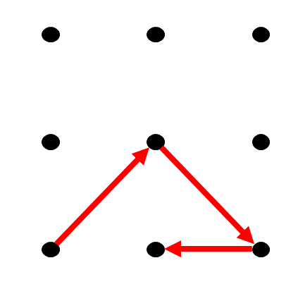

# 🇩🇰 Yodaway Smartpoint

Yodaway, the danish retailer Alf comes from has created their own application for 🇨🇳 Sanbot Elf. This page goes into how to use those applications to customize the user experience.

::: info
Read more about Yodaway on their webpage >[here](https://yodaway.com/en/)<

:::

1. Smartpoint app
2. Smartpoint web software

## 1\. Smartpoint app

The Smartpoint app can be located on Alf in the admin user menu.

::: info
To access the admin menu simply press the  **\->\]** sign in the upper right corner of the screen.

*The password can be found in [Bitwarden](../../../Onboarding/Software/Bitwarden.md).*

:::

Once the Smartpoint app is loaded it can be controlled from the Smartpoint web software.

To exit the Smartpoint app on Alf, hold very far up in the upp right corner. A gesture prompt should follow. Use the following gesture to exit the application:

## 

## 2\. Smartpoint web software

The Yodaway online dashboard can be found at <https://dashboard.yodaway.com>

*Short Readme of features available on Yodaway Smartpoint Developer Platform*

::: info
Readme is available as a pdf >[here](../readme_smartpoint.pdf)<

:::

<!-- This is borked, use pdf above
### Home screen

* Splash screen with **Devices** (aka robots)
* User info with logout in top-right corner
* Shows a quick summary of recent **Polls** done on the Smartpoint Robot app

### Layouts Screen

* Lists all **Layouts**
* **Publish** radio-button activates select **Layout** on the Robot app

### Edit layout

* Dendrogram layout building downwards
* Each **Page** is populated with **Buttons** above
* You are unable to merge diverging paths 
  * In a Quiz there will hence be exponentially more **Pages** for each diverging/question as you can't have a standard "wrong" answer page.

### Edit Page 01

* **Layout** styles with option for embedded **Website** 
  * Can embed videos and/or dynamic content
  * Very limited JS usability
* Different **Button** styles 
  * Must still be edited using custom **media**
* Custom backgrounds and simple text

### Edit Page 02

* TTS using ssml and Google. 
  * Dropdown for different languages, limited availability from Google
  * Set TTS voice speed using slider
* Dropdown with Robot face-emotion on **Page** start.
* Simple Robot movements on **Page** start.
* Custom Robot responses for each touch sensor 
  * No function during testing / disabled functionality

### Edit a button

* Button settings 
  * Upload custom image for your **Button**
* Label settings for Yodaway Dashboard developer interface
* Additional settings for marketing research and results 
  * Use case not explored

### Upload media

* Upload new **media** or select from previously uploaded **media** 
  * No known method of deleting uploaded **media**
* Uploaded **media** automatically gets re-scaled into 4 additional media fit for the Robot app

### Scheduler

* Create a **Schedule** for when the Robot app should Publish specific **Layouts**
* Select from your **Layouts**

## 

Statistics

* Results from **Layout Polls**
* Marketing feature 
  * Use case not explored

### Gallery

* Create a **Gallery** of uploaded **media** for a slideshow

### Profile

* User profile settings with ability to add **devices** (Robots) and see licenses.

 -->