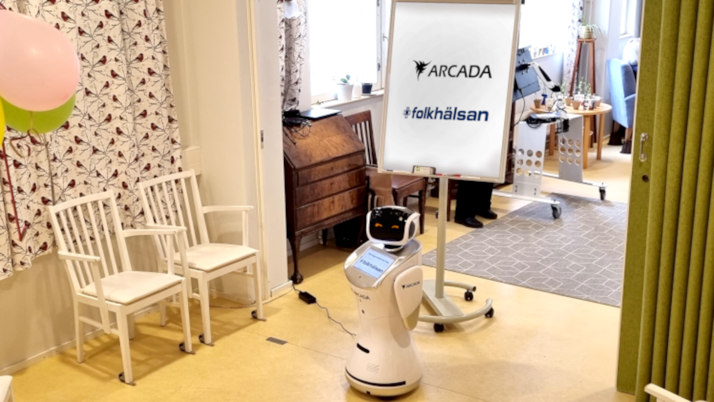

In spring of 2023 Alf was working at Folkhälsan’s establishment in Brunakärr, Helsinki. Alf was kept busy hosting spring quizzes, dancing, projecting gymnastic instructions, informing about the days activities and lunch and finally just acting as a sociable jukebox with assorted popular songs the elderly had wished for in advance.