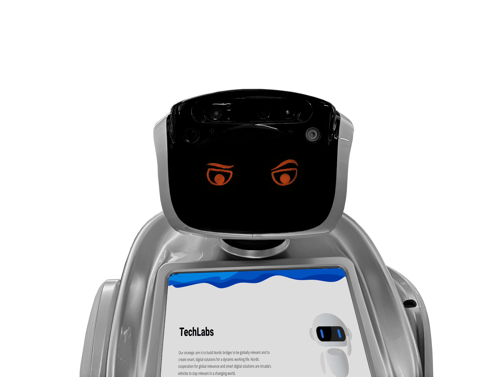

Alf arrived together with [Amy](../Amy%20&%20Alex/Readme.md) during the AFORA (Amy FOR Arcada) project. A learning and development project that, together with students and co-workers, explore possibilities with humanoid robots in different studying contexts.

Since then Alf has been a versatile and popular robot at Arcada having worked in [dental care](Dental%20care.md), entertainer, educator, informer and in [elderly care](Elderly%20Care.md).

Alf mainly uses 🇩🇰 Yodaway Smartpoint application these days, you can learn more >[here](./Documentation/Yodaway%20Smartpoint.md)<