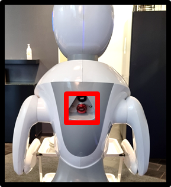

# Emergency stop

Whenever you and others use Amy and/or Alex always make sure you know where and how to use the **emergency stop** button, found on the back of the robot.

::: error
Push the button **in** to stop the robot!

*The button is located back under the neck on both robots.*

:::

## Undo emergency stop

::: success
🔄 Turn the button to reactivate the navigation system.

:::

If others ever are responsible for the robot make sure you instruct them on how to use the emergency stop.

## The Number 1. Rule!

::: success
🛑 Emergency stop is **always** the best option when something goes wrong!

:::

Pushing the emergency button means the robot will not navigate and can be freely pushed and moved by the user.

🎉 Congratulations, you now know the emergency policy!