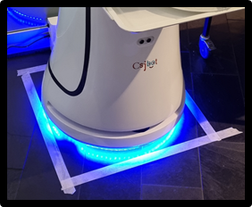
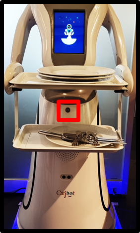
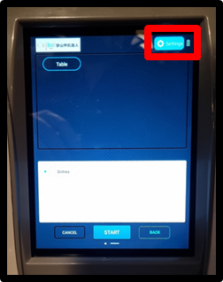
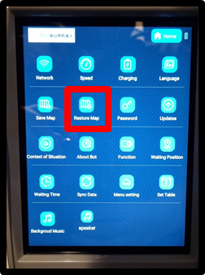
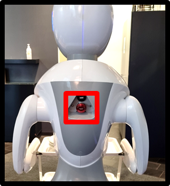
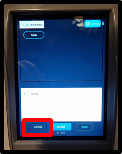

# Amy quick start guide

::: warn
Before first use; read the [**Emergency Policy**](Emergency%20Policy.md)

:::

The guide includes the following:

1. Starting the robot
2. Restoring the map
3. Stopping or moving the robot

## 1\. Starting the robot

Place the robot in the preferred starting position, usually close to the charger or in a designated area.

To power on the robot, find the power switch between the trays and press.

The robot makes a sound when it starts.

Wait for the floating robot to appear, this means the software is loading. Once a button with chinese text appears in the bottom right corner the software is ready to use, simply press the screen.

Before using the navigation, the map must be restored.

::: info
To turn the robot **off**, simply hold the power switch for about 5 seconds.

:::

## 2\. Restoring the map

Go to settings and use the password found in >[Bitwarden](../../../Onboarding/Software/Bitwarden.md)<.

Choose **Restore Map,** to restore the map.

## 

3\. Stopping or moving the robot

*3 simple steps to safely move the robot*

1. Press **emergency stop**

   
2. Press **cancel** in the software

   
3. Move the robot

Use your body to move the robot around!💪  
If it is heavy you probably forgot to activate the **emergency stop**.