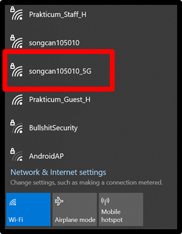
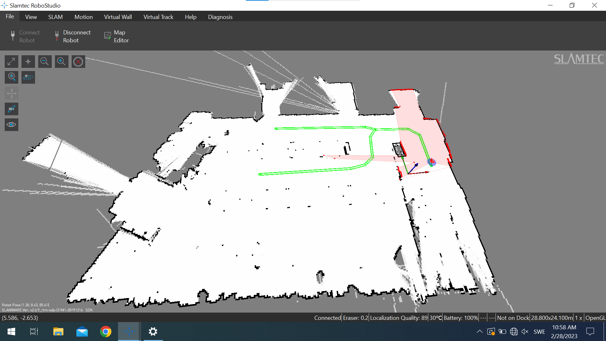
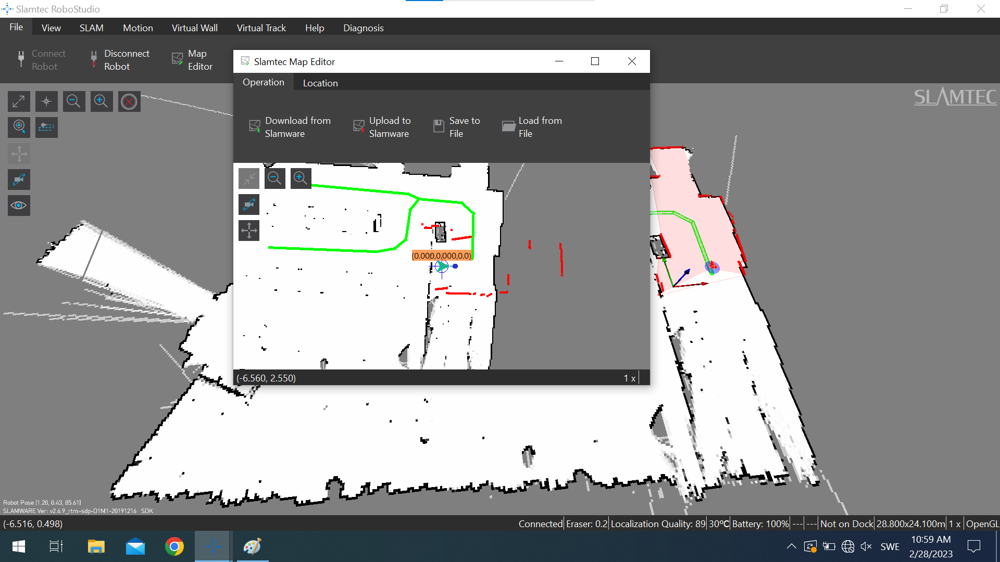
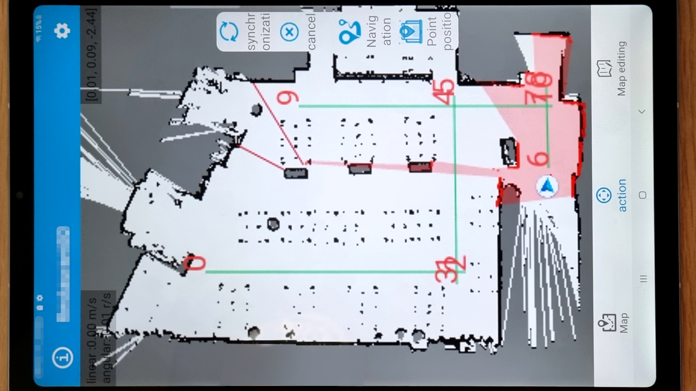
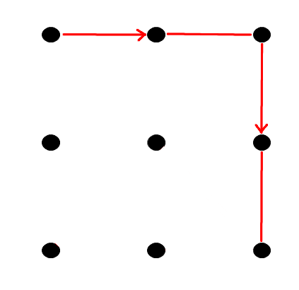

::: warn
Before first use; read the [**Emergency Policy**](Emergency%20Policy.md)

:::

Amy and Alex are both Csjbots Amy delivery robot, the official manual can be found >[here](../Amy-English-Manual-10th-20211124.pdf)< as pdf.

## Techlabs documentation

The following chapters are available

1. Controller
2. Amy software
3. Alex software
4. Gesture password

### 🎮 1. Controller

Amy can be controlled with the accompanying 💻 laptop and the software.

Alex can be controlled with accompanying 📱 tablet and software.

Each robot has its own WiFi. Any controller (tablet or laptop) needs to be connected to that specific WiFi to access the robot and be able to control Amy or Alex.

### 💻 2. Amy software

To control Amy you use RobotStudio on Windows 10. The robot can be controlled with standard arrow keys ⬅️ ⬆️ ⬇️ ➡️ .

To create navigation paths (🟩 green lines) for the robots AI you drag paths using 🖱️ mouse input and select tool in the software.

The map editor is used to upload and download the map to and from the robots Slam navigation.

### 📱 3. Alex software

Alex uses RobotStudio Andriod version and similarly can be navigated on the map. The similarities between software are many.

When making navigation paths, to make them connect the paths must be ❎ intersected as in the image below.

### 🤙 4. Gesture password

When Alex is navigating around the area there is a default gesture password, see image.

