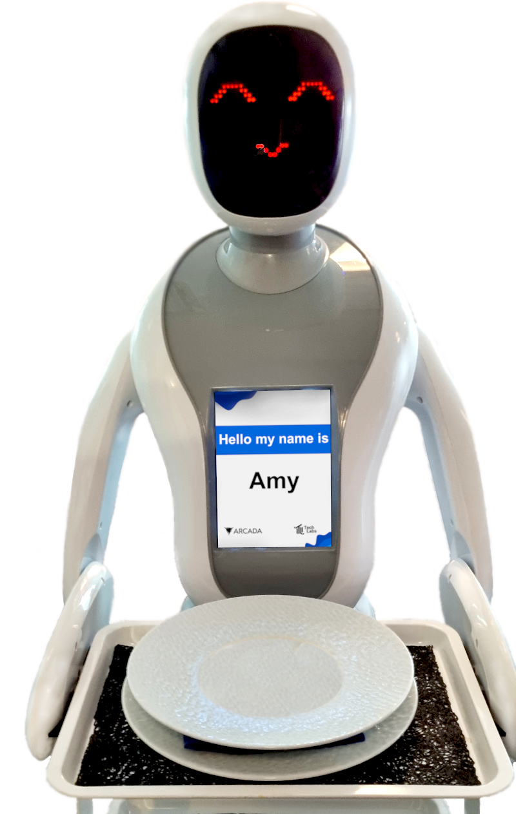

Originally Amy arrived during the AFORA (Amy FOR Arcada) project. A learning and development project that, together with students and co-workers, explore possibilities with humanoid robots in different studying contexts. The project was made possible by financial support from the Lindstedt Foundation and predates the funding of Techlabs!

Alex, Amy's sibling arrived 2022. Both robots are from 🇨🇳 Csjbots Amy delivery robot line and utilizes high-precision LiDAR sensor for navigation and multiple trays for carrying dishes in catering.

::: info
Read the official site >[here](https://www.csjbot.net/amy-product/)<

:::