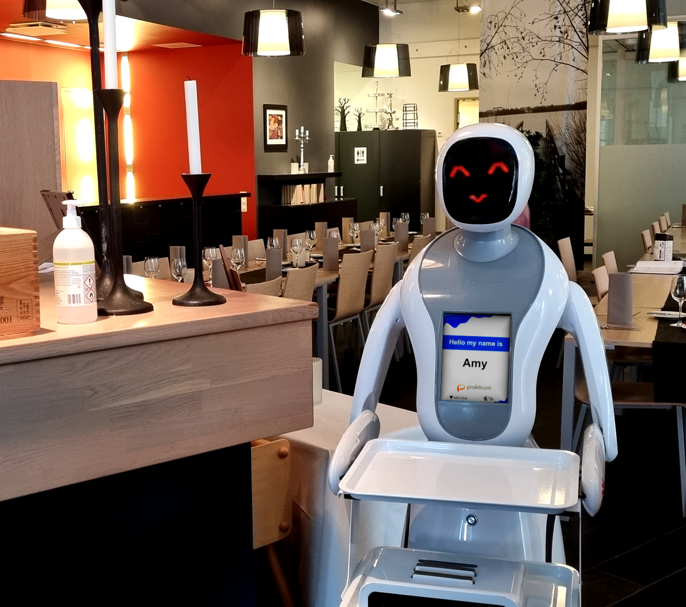

*"The CASSIOPEIA research project deployed humanoid service robots, Amy and Alex, as waiters in a restaurant setting. The study aimed to maximize the robots' capabilities and involved collaboration with the restaurant staff. The robots showcased autonomous navigation using sensors and software. Their appearance and interactive features facilitated engagement with customers. Specific restaurant types and end-users' preferences were found to be crucial for successful robot deployment. Challenges included staff readiness and physical space constraints. The study emphasized the need for further research on humanoid robot deployment in the service sector and understanding clients' and customers' perceptions. Overall, the project highlighted the importance of designing restaurants with service robots in mind." - Christa Tigerstedt, CASSIOPEIA Project Lead*