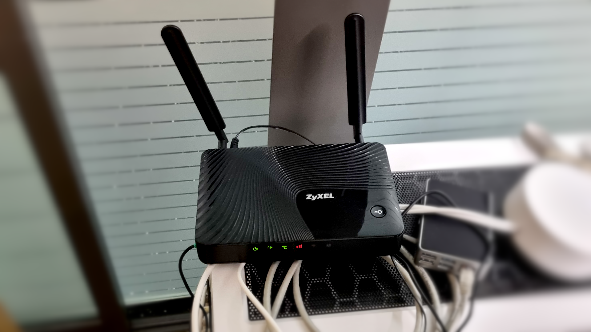
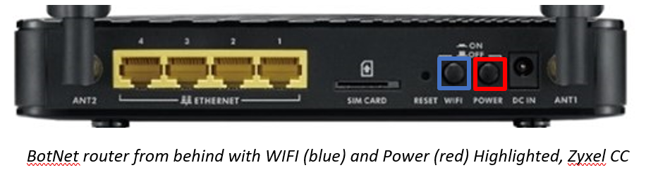
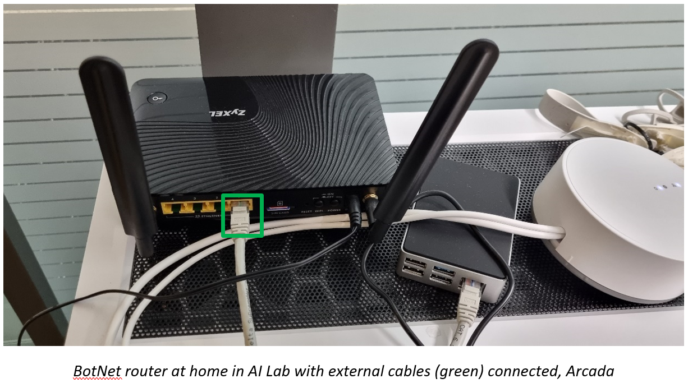

*The router that connects!*

## What is BotNet?

Botnet is a WLAN, Wireless local-area network. It is a wireless network, WiFi, 🌍 the Internet.

Well more specifically it is a router, Zyxel LTE3301 that uses the LTE protocol and a 4G sim card (like a phone) to share a network we named BotNet.

::: info
BotNet is for 🏠 indoors use only and need a 🔌 power adapter to function.

:::

## Why do we need BotNet?

BotNet is mainly used for research purposes. In research, experiments are often performed with new and untested code, unknown packages or programs. Therefore, it is good practice and an extra safety measure that these experiments are **not** carried out directly on the establishments network.

Some of our robots also come from regions with fewer obligations and does not always comply with Europe's strong privacy laws (such as GDPR). Therefore, these robots are also linked to BotNet so as not to affect none-research users on other networks.

#### Portable!

BotNet is also used when robots go on trips or events. The BotNet router can be conveniently taken and provide internet access to any of our robots as long as there is a regular wall outlet to supply the router with power.

## How do I use BotNet?

All robots and hardware using BotNet should be connected and connect to the WLAN automatically. In case of problems, network settings are usually found under ⚙️ Settings - Network

#### Troubleshooting

If the problem is with your router, it's usually easiest to restart it. There is a button on the back (red) To turn off the router, use the old but proven method of waiting at least 5 seconds before starting the router again. You can also check that the WIFI button isn't disabled by mistake. (Blue)

#### How to travel with BotNet?

Remove all external cables (green), taking the power adapter with you and the router. Then plug in the router at your travel location. After a while (please wait at least 2 minutes for everything to work) the WLAN should  be visible and your robots should connect to it.  
When returning the router, place it in the same location and reconnect the external cable (green).

::: info
Need the Password?

Get the password on 🔒 [Bitwarden](../Onboarding/Software/Bitwarden.md) from an admin!

:::