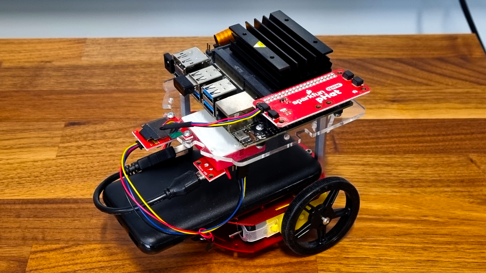

Techlabs Jetson Nano, also known as Lilla My, is a Jetson Nano 2GB Developer Kit attached with a Sparkfun pHat, battery and a camera, orignally bought for researching [Real-time Human Pose Estimations](https://developer.nvidia.com/embedded/community/jetson-projects/nv_trt_pose) the robot is now available for computer vision projects and navigation.

::: info
You can read more about the Jetson Nano 2GB on the official documentation >[here](https://developer.nvidia.com/embedded/learn/get-started-jetson-nano-2gb-devkit#next)<.

:::