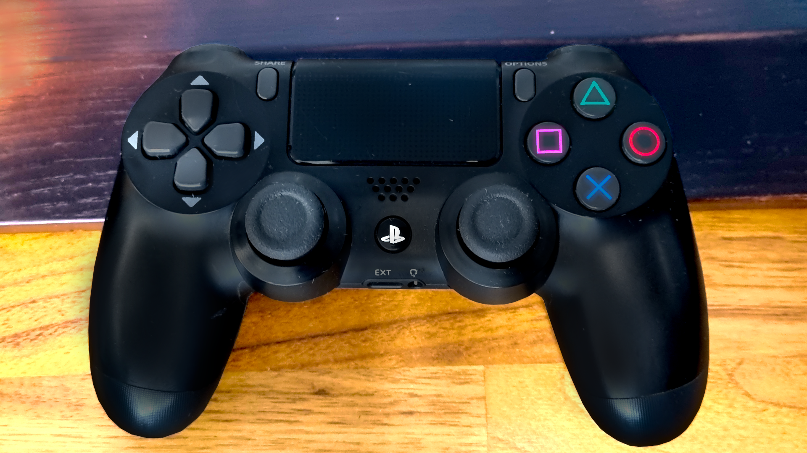

# 🎮 Pupper Robot controls🎮

At Techlabs we use a standard **PS4 controller** to steer Mini Pupper  
*The following instructions are taken directly from the offical Mini Pupper documentation*

## Controls

* **L1**: Press to toggle active mode and deactivate mode. 
  * Note: the controller’s front light will change colors to indicate if the robot is deactivated or activated.
* **R1**: Press to transition between Rest mode and Trot mode.
* **Left joystick** 
  * Forward/back: moves the robot forward/backward when in Trot mode.
  * Left/right: moves the robot left/right when in Trot mode.
* **Right joystick** 
  * Forward/back: pitches the robot forward/backward.
  * Left/right: turns the robot left/right.
* **D-Pad** 
  * ↕️ Forward/back: raises and lowers the body.
  * ↔️ Left/rights: rolls the body left/right.
* “**X**” button: Press to make the robot hop. 
  * Press it three times for a complete full hop.

### Boot sequence

::: info
When booting Mini Pupper and the controller hold **Select** on the PS4 controller to connect it to Mini Pupper

:::

::: info
**Official** documentation can be found here >[here](https://minipupperdocs.readthedocs.io/en/latest/guide/QuickStartGuide.html)<

:::