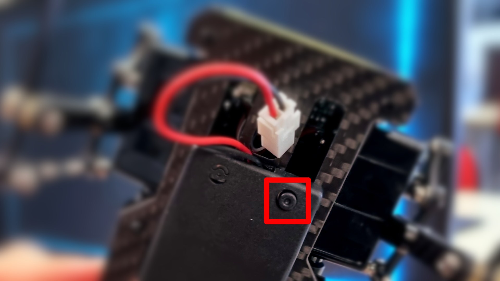
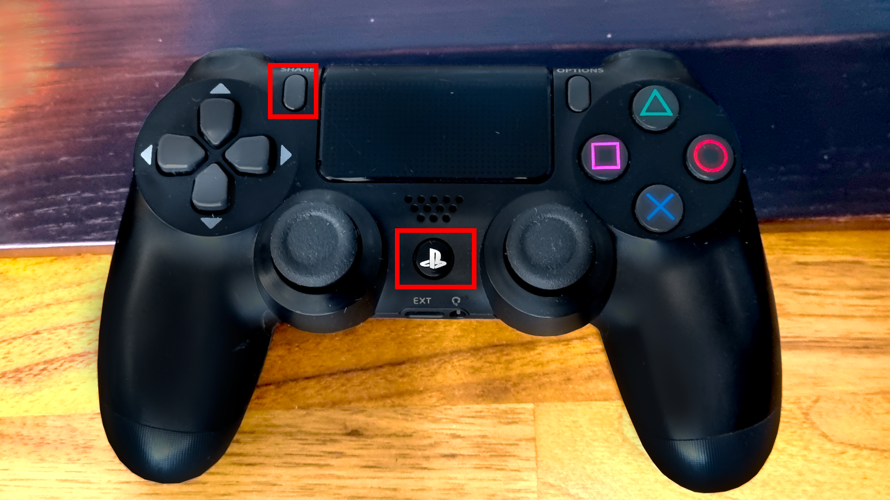

To quickly get going with the Mini Pupper follow these 3 steps:

::: info
🔋  Remember to keep your Mini Pupper and all your peripherals charged before use 🔋

:::

::: warn
If you use 🔌  external power supply to power the robot with anything higher than **8\.4V** (aka >2S) you’ll almost certainly fry all your servos!

:::

1. Start your Mini Pupper, simply hold the power button on the battery located under the robot.

   
2. Start your PS4 controller while holding the **Share** button in proximity to your Mini Pupper

   
3. Once the controller LED changes to **green**🟩 you are ready to go!

   

::: info
Check out the 🎮 [controls](Controls.md) on how to steer Mini Pupper.

:::