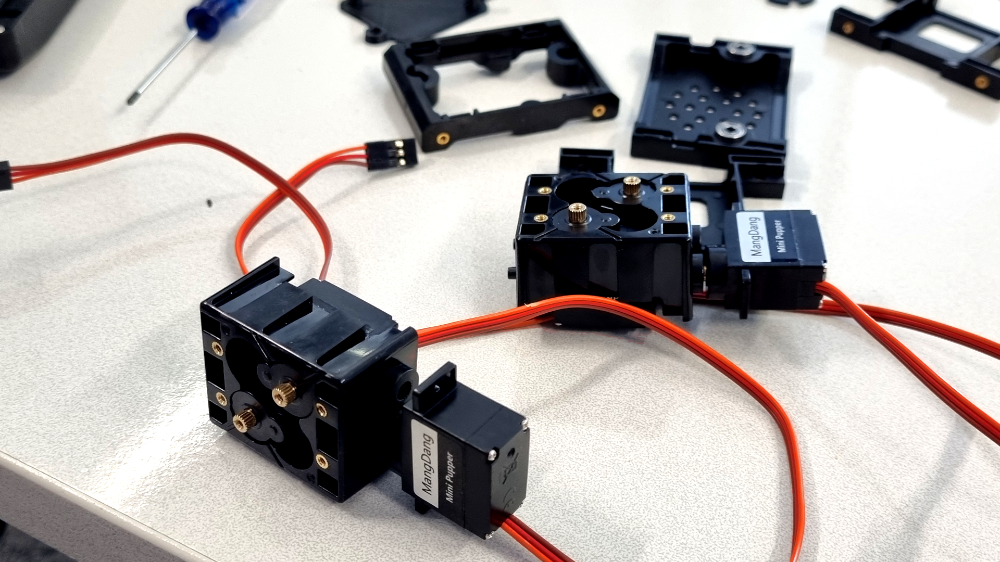
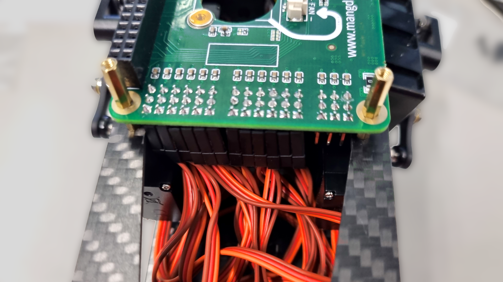

Mini Pupper is completely open source and all instructions and blueprints can be found online.

::: info
The official documentation can be found >[**here**](https://minipupperdocs.readthedocs.io/en/latest/index.html)<.

:::

## Hardware

The robot consists of a 3D printed skeleton and 12 servos, 3 per leg for **12-degrees-of-freedom**, a real agile 🐾 "Pup" compared to more common 8 degrees of many other commercial robots.

All the servos are connected to a Raspberry Pi model 4B through a special compute module. While the face is an LCD display to allow for simple 😶 facial gestures.

## Software

Currently there is 2 💿 images for the Raspberry Pi and Mini Pupper:

1. A modified version of Ubuntu with calibration for the Mini Pupper that allows for manual control with a 🎮 controller.
2. A ROS based image for automation and AI controlled maneuvering

*\* Techlabs currently only uses the first image*

## Continoue reading:

* [Quick start](Quick%20start.md)
* [Controlls](Controls.md)
* [Offical documentation](https://minipupperdocs.readthedocs.io/en/latest/index.html)

::: warn
If you use 🔌  external power supply to power the robot with anything higher than **8\.4V** (aka >2S) you’ll almost certainly fry all your servos!

:::