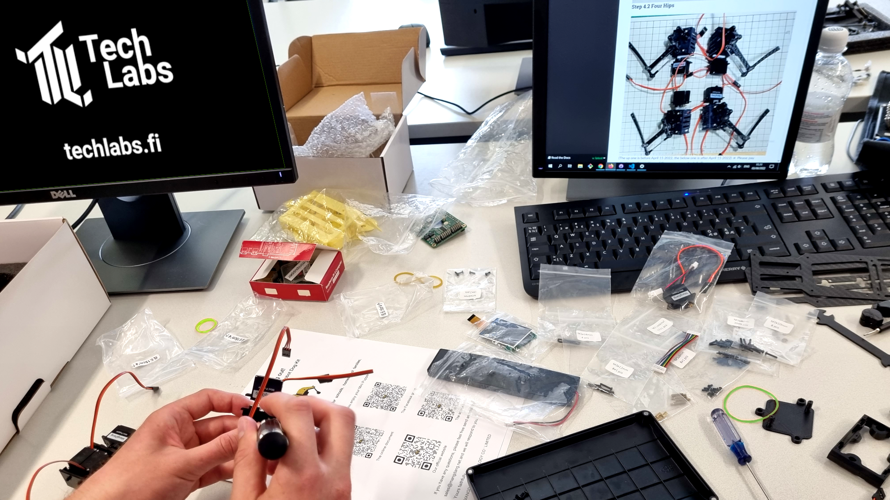

# Techlabs Mini Pupper

Techlabs Mini Pupper arrived back in early 2022 and was constructed on site by students from Arcada University of Applied Science.

The full assembly instructions for Mini Pupper can be found >[here](https://minipupperdocs.readthedocs.io/en/latest/guide/Assembly.html)<.

The Techlabs Mini Pupper is a MangDang Mini Pupper version 1. The robot was developed by MangDang based on Stanford Universities Pupper together with its creator Nathan Kau. The goal behind Pupper and Mini Pupper was to make it more accessible for robot enthusiast to build their own robots and to enable research and development on robots for a wider market.

Mini Pupper is completely open source and all instructions and blueprints can be found online.