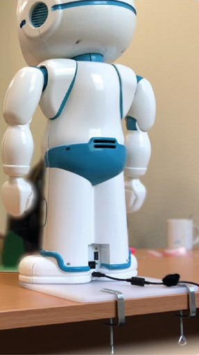

# Official documentation

<https://docs.luxai.com/>

# TechLabs documentation

We have the following 2️⃣ languages available for speech synthesis and speech recognition directly from LuxAI:

🇬🇧  English

🇸🇪  Swedish

## Working with Children

When working with children in all circumstances keep your QTrobot anchored and attached to a stable surface. Not only does this protect the equipment but it also prevents any unnecessary stress for the user about breaking the robot.

## Troubleshooting - Connecting the tablets

When booting up QTrobot there seems to be a grace period before it stops allowing new bridge connections with the tablets.

If you encounter issues with connecting the tablets to the robot:

1. Make sure **BotNet** is nearby to the connection is strong. For password go to Bitward.
2. Restart QTrobot and the tablets. Try to make sure the tablets are started in quick succession after QTrobot.