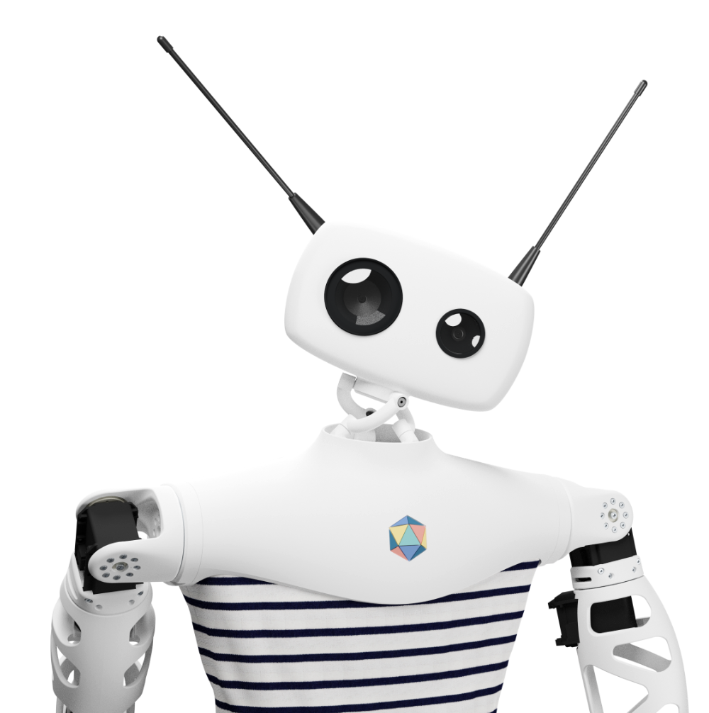

# Reachy robot

Hello and welcome to the Reachy documentation. The documentation for Arcadas most recent and most advanced robot from [Pollen Robotics](https://www.pollen-robotics.com/) in France. They have the following to say:

> Reachy is an expressive open-source humanoid platform programmable with Python and ROS. He is particularly good at interacting with people and manipulating objects.

|                              |                         |
|------------------------------|-------------------------|
| **Feature tabel**                |                         |
| Objects Manipulation         | Artificial Intelligence |
| Remote teleoperation with VR | Evolutive & Modular     |
| Available with mobility      | Easy to use Python API  |
| Interactivity                | Fully programmable      |
| Open source Hardware         | Powered by ROS          |
| Customizable                 | Made in France 🇫🇷     |

> No need to train up the machine learning component: jump straight into any desired application and start prototyping.

At TechLabs we choose Reachy and Pollen robotics for their sustainability in going Open source, their feature rich tool set, their cutting edge innovation and commitment to quality, measured from their previous project Poppy. With Pollen robotics we knew we'd get the robot we needed for todays research but also for tomorrows challenges.

In this collective you can find our work with Reachy and useful links on how to get started.

* [Official documentation](https://docs.pollen-robotics.com/)
* [Official GitHub](https://github.com/pollen-robotics)