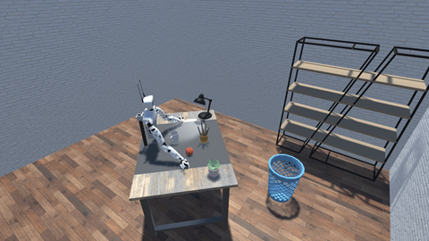
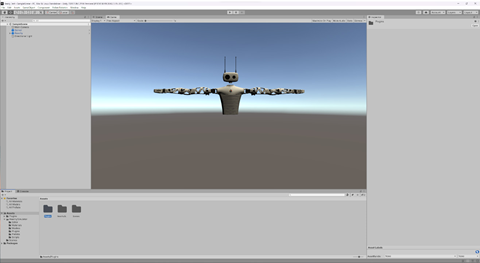

# Reachy in Unity

###### Getting started with simulating Reachy 🦾

Standard Pollen Robotics Unity Scene. Used for testing and simulating the Pollen Robotics robot Reachy



::: info
**Quick setup**

For the fastest, up and running simulation on **Windows**, simply **download** the [release package](https://github.com/pollen-robotics/reachy2021-unity-package) and start the .exe file from Pollen Robotics, and you should be greeted with the following Unity scene:

:::

Follow the instructions on <https://github.com/pollen-robotics/reachy2021-unity-package>

1. Start by downloading Unity Hub from the Unity website and install it.
   1. <https://unity.com/>
2. Download the Pollen Robotics Unity Package for Reachy
   1. <https://github.com/pollen-robotics/reachy2021-unity-package>
3. Unpack said package and import it into Unity
   1. Use the suggested version Unity suggests, 2020.1.0b7
      1. There was Issues with LTS 2020.1 and Reachys mesh import (2023.05.22)
4. Download the grpc_unity_package
   1. <https://packages.grpc.io/archive/2022/04/67538122780f8a081c774b66884289335c290cbe-f15a2c1c-582b-4c51-acf2-ab6d711d2c59/csharp/grpc_unity_package.2.47.0-dev202204190851.zip> (2023.05.22, see [github repository](https://github.com/pollen-robotics/reachy2021-unity-package) if link has expired)
5. Add the grpc package into the Unity projects Assets folder (drag&drop works)
6. Add Reachy and Server from your prefabs into the scene
7. Position Reachy in view of the Main Camera
8. Hit play! ▶️

You should see a scene in Unity similar to this:



## Coding

Start your Python environment, we would recommend a clean environment, for example using Anaconda. For a example:

```
conda create --name reachysdk
python=3.7 -y
```

::: warn
*Python 3.10 has issues with grpc (2023.05.22), use Python 3.7 as a solution*  
<https://github.com/pollen-robotics/reachy-sdk/issues/39>  
<https://github.com/grpc/grpc/issues/27888>

:::

**Don’t forget to activate your envioronment**

```
conda active reachysdk
```

Install reachy sdk using pip:

```
pip install reachy-sdk
```

With the sdk installed simply import it
into your Python project:

```
from reachy_sdk import ReachySDK
from reachy_sdk.trajectory import goto
from reachy_sdk.trajectory import InterpolationMode
```

You are now good to go! Use the sample code available from their article or write your own!

<https://medium.com/pollen-robotics/controlling-a-reachy-robot-in-unity-f3d90d550345>

### Known issues:

Currently (2023.05.22) the documented command (look_at) for moving Reachys head is **not implemented** in the Reachy Unity package:

```
pip install reachy-sdk
```

Install version 0.7.0, not yet compatible with Reachy Unity Package use older version:

```
pip install reachy-sdk==0.5.4
```

Alternative solution for Reachy 2023 and reachy-sdk 0.7.0, change the following:

```
reachy.head.look_at(x, y, z, duration=t)
```

**Use this instead:**

```
head_tilted_position = {
    reachy.head.neck_roll: 0,
    reachy.head.neck_pitch: 0,
    reachy.head.neck_yaw:0,
}
goto(
    goal_positions = head_tilted_position,
    duration = 1.0,
    interpolation_mode = InterpolationMode.MINIMUM_JERK
)
```

## Sources:

Unity

<https://unity.com/>

Pollen Robotics Unity Package Github respository

<https://github.com/pollen-robotics/reachy2021-unity-package>

Pollen Robotics Unity Package Medium Article

<https://medium.com/pollen-robotics/controlling-a-reachy-robot-in-unity-f3d90d550345>

Pollen Robotics Creating a virtual scene for reachy - manual

<https://pollen-robotics.github.io/reachy-2019-docs/docs/simulation/create-your-own-scene/>

Unity: Basketball

<https://gist.github.com/glannuzel/1b6f04a57028cebe273d91aa8bd207de>

Unity: Hello World

<https://gist.github.com/glannuzel/b945e1f4068c88c6d1c07e98f9eaeb32>