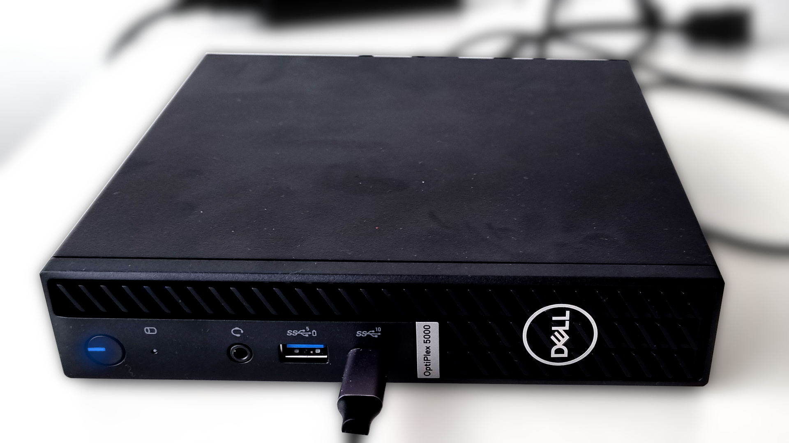
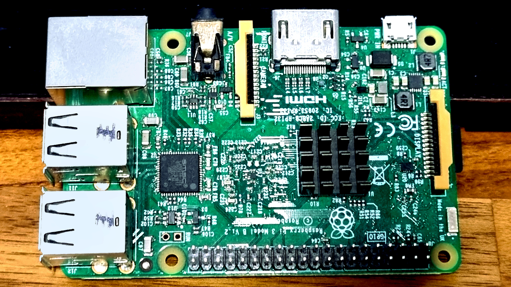
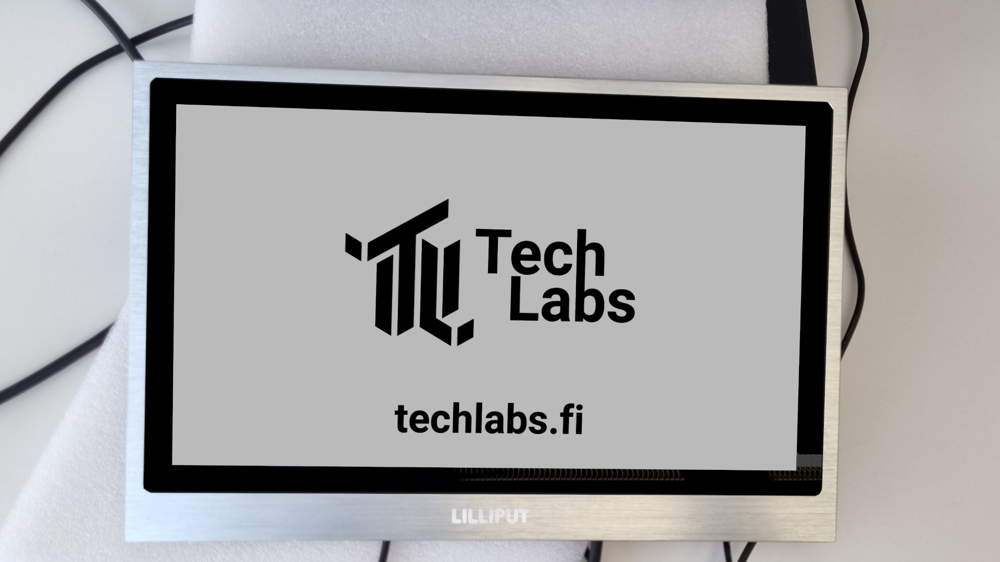

# Csjbot

* Offical documentation 
  * [https://www.csjbot.net/snow-product](https://www.csjbot.net/snow-product/)

## Techlabs

Snow at Techlabs has been redeveloped into an open-source project by junior developer Jonas Irjala and as such standard documentation does not follow.

::: info
Read about the open-source project >[here](Open-source.md)<.

:::

#### New hardware

Inside Snow can now be found a Dell Optiplex that runs Ubuntu 20.04 for the broadest usability.

##### Technical specifications:

|          |                                                                                                         |
|----------|---------------------------------------------------------------------------------------------------------|
| **CPU**      | I5-12500T - Intel UHD Graphics 770                                                                      |
| **Memory**   | 16GB DDR4 SDRAM                                                                                         |
| **Wireless** | Bluetooth 5.1                                                                                           |
| **Ports**    | *Front*                                                                                                   |
|          | 1 USB 3.2 Gen 1 port with PowerShare                                                                    |
|          | 1 USB 3.2 Gen 2x1 Type-C® port                                                                          |
|          | 1 Universal audio jack                                                                                  |
|          | *Rear*                                                                                                    |
|          | 1 RJ45 Ethernet port                                                                                    |
|          | 1 Optional port (HDMI) 2.0b/Displayport 1.4a (HBR3)/VGA/PS2/serial/USB Type-C with DisplayPort Alt mode |
|          | 1 USB 3.2 Gen 1 port with Smart Power On                                                                |
|          | 3 USB 3.2 Gen 1 ports                                                                                   |
|          | 2 DisplayPort 1.4 (HBR2)                                                                                |
|          | 1 Power adapter port                                                                                    |
| **Storage**  | 512 GB - M.2 2230                                                                                       |

::: info
Read official documentation on the Dell Optiplex >[here](https://www.dell.com/za/enterprise/p/optiplex-5000-micro/pd)<

:::

You will also find a Raspberry Pi 4B inside Snow for controlling the facial expression API, developed by junior developer Sigrid Hallik.

##### Technical specifications:

|          |                                                                                            |
|----------|--------------------------------------------------------------------------------------------|
| **CPU**      | Broadcom BCM2711, Quad core Cortex-A72 (ARM v8) 64-bit SoC @ 1.8GHz                        |
| **Wireless** | 2\.4 GHz and 5.0 GHz IEEE 802.11ac wireless, Bluetooth 5.0, BLE                             |
| **Ethernet** | RJ45 Gigabit Ethernet                                                                      |
| **USB**      | 2 USB 3.0 ports; 2 USB 2.0 ports.                                                          |
| **GPIO**     | Raspberry Pi standard 40 pin GPIO header (fully backwards compatible with previous boards) |
| **Outputs**  | 2 × micro-HDMI® ports (up to 4kp60 supported)                                              |
| **Storage**  | Micro-SD card slot for loading operating system and data storage                           |

::: info
Read official documentation on Raspberry Pi 4B >[here](https://www.raspberrypi.com/products/raspberry-pi-4-model-b/)<

Read official specifications >[here](https://www.raspberrypi.com/products/raspberry-pi-4-model-b/specifications/)<

:::

Lastly the display on Snow has also been replaced, it now runs a Lilliput 13.3" touch screen monitor. The change was mostly motivated due to accessibility and compatibility with the internal hardware.

##### Technical specifications:

|                   |                    |
|-------------------|--------------------|
| **SKU:**              | TK1330-NP/C/T      |
| **Screen Size:**      | 13\.3 inches        |
| **Resolution:**       | 1920x1080          |
| **Screen:**           | LED                |
| **Aspect Ratio:**     | 16:9               |
| **Housing Material:** | Metal              |
| **Brightness:**       | 300 cd/m^2         |
| **Inputs:**           | AV, VGA, HDMI, DVI |

::: info
Read official specifications on the Lilliput monitor >[here](https://lilliputweb.net/tk1330-np-c-t-13-3-full-hd-hdmi-monitor-with-capacitive-touch-function/)<

:::