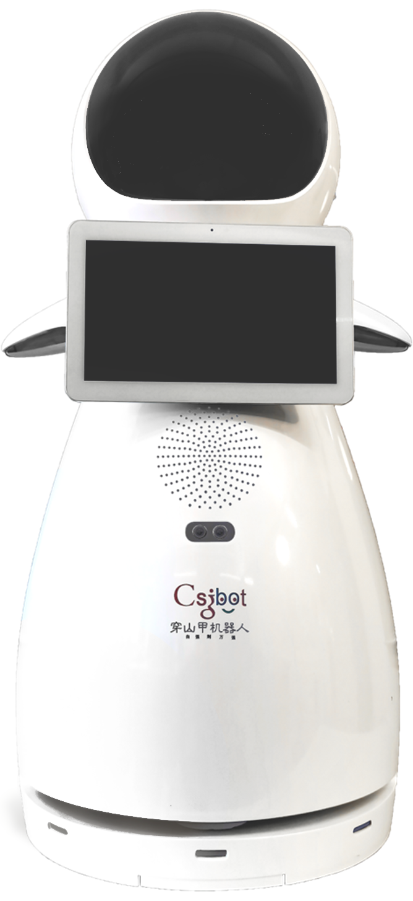

# Csjbot Snow

Snow is according to Csjbot a commercialized education robot, with a friendly and comforting design aimed to entice users of all ages. The robot has facial recognition software, voice direction detection and a navigation system, helpful for taking users to specific locations in an establishment or building.

Our Snow robot at Techlabs has had one of the more unique journeys, having had stifled development due to platform issues in 2021. Breaking in 2022 and finding a workaround custom fix to the problem with a Re-speaker and a Raspberry Pi. To finally 2023, where Snow is underwent a complete revamp into an [open source robot](Open-source.md)!